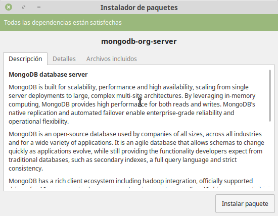

[`Fundamentos de Base de Datos`](../../Readme.md) > [`Sesión 05`](../Readme.md) > Ejemplo-01
## Instalación y ejecución de MongoDB

### OBJETIVO
- Que el alumno aprenda a instalar MongoDB
- Que el alumno inicie un servidor de MondoDB

### REQUISITOS
1. Repositorio actualizado
1. Usar la carpeta de trabajo `Sesion-05/Ejemplo-01`

### DESARROLLO
1. Entra a la [Página Oficial de Descarga de MongoDB](https://www.mongodb.com/download-center/community)

   1. Selecciona __Server__
   1. Secciona tu sistema operativo (Linux, Mac o Windows)
   1. Dá click en __Download__

   Alternativamente para Linux y MacOS puedes también agregar las librerías de MongoDB con su menajador de paquetes (apt, yum, brew, etc.)

   https://docs.mongodb.com/manual/tutorial/install-mongodb-on-ubuntu

   También alternativamente para MacOS puedes instalar MongoDB usando `brew`, si deseas seguir este camino, puedes revisar las instrucciones en el siguiente enlace:

   https://docs.mongodb.com/manual/tutorial/install-mongodb-on-os-x/

1. Instalación para GNU/Linux

   1. Ejecuta el instalador dando doble click en el archivo `.deb`, `.rpm` o el que hayas descargando para tu distribución de Linux.
   1. Se abrirá el asistente de instalación de software, entonces da click en el botón __Instalar paquete__
      
   1. Terminar la instalación y cerrar las ventanas
   1. Para iniciar el servidor de MongoDB abre una terminal y ejecuta lo siguiente:
   ```console
   $ sudo service mongod start
   ```

1. Instalación para Windows

   1. Ejecuta el instalador dando doble click en el archivo `.msi`
   1. Selecciona la opción __Complete__
   1. Selecciona la opción __MongoDB Service__
   1. Selecciona la opción __Run the service as Network Service user__
   1. Deja los campos: __Service Name__, __Data Directory__ y __Log Directory__ como vengan predeterminados.
   1. Terminar instalación
   1. Crear la carpeta `C:|data\db` usando el explorador de archivos.

1. Instalación y ejecución para MacOS

   1. Descomprime el archivo `.tgz` dando dobel click sobre el, esto creará una carpeta.
   1. Copia la carpeta que se descomprimió a esta ruta `/usr/local/bin`
   1. Crea la carpeta `/data/db/` y asegurate de tener permisos de escritura
   1. Para iniciar el servidor de MongoDB abre una terminal y ejecuta lo siguiente:
   ```console
   $ mongod
   ```
