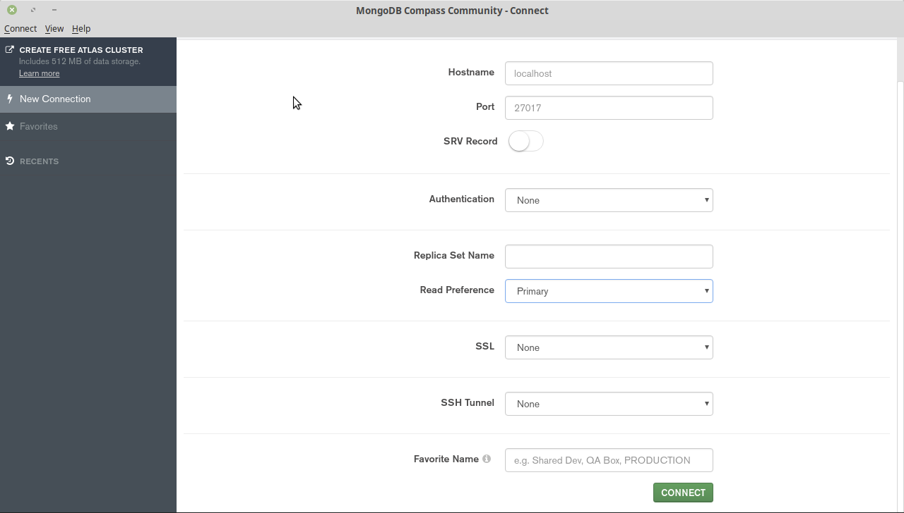
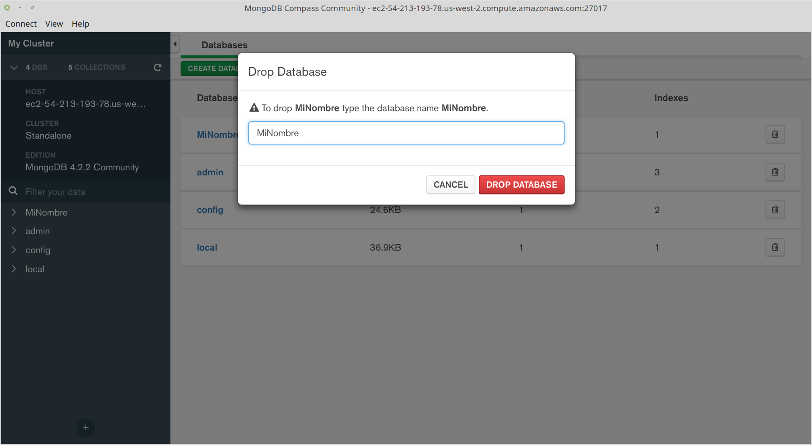

[`Fundamentos de Base de Datos`](../../Readme.md) > [`Sesión 05`](../Readme.md) > Ejemplo-01
## Conectando con un Servidor MongoDB y realizando operaciones con bases de datos

### OBJETIVO
- Que el alumno se conecte a un servidor MongoDB
- Que el alumno realice operaciones con bases de datos
- Que el alumno cuente con una base de datos para trabajar

### REQUISITOS
1. Repositorio actualizado
1. MongoDB Compass instalado
1. Datos de conexión al Servidor MongoDB
1. Usar la carpeta de trabajo `Sesion-05/Ejemplo-01`

### DESARROLLO
1. Ejecutar __MongoDB Compass__ y esperar hasta observar una ventana similar a la siguiente.

   

   Se tiene que hacer uso de los datos de conexión proporcionados por tu Experta/o y para efectos de demostración se usarán los siguientes:
   - __Hostname:__  ec2-54-213-193-78.us-west-2.compute.amazonaws.com
   - __Port:__ 27017
   - __Authentication:__ Username / Password
   - __Username:__ root
   - __Password:__ bedu
   - __Authetication Database:__ admin

   Una vez ajustados los datos presiona el botón __CONNECT__ que hará que __Compass__ se conecte a nuestro servidor local de MongoDB:

   
   Y lo que aparece a la izquierda detalles de la conexión realizada y en la parte inferior la lista de las bases de datos disponibles, a la derecha es una lista de las mismas bases de datos:
   - admin
   - config
   - local

   Estas bases de datos son necesarias para el funcionamiento interno de MongoDB, así que de preferencia no las uses ni las modifiques.

1. En la ventana de __MongoDB Compass__ presionar el botón __CREATE DATABASE__ y crear la base de datos __MiNombre__ con la colección __users__, se tiene que definir el nombre de la primera colección para que se pueda crear la base de datos.

   En lugar de __MiNombre__ utiliza tu nombre y primer apellido para nombrar a tu base de datos, ya que tu base de datos y la de tus compañeros serán creadas en el mismo servidor.

   
   Una vez llenado los datos, presionar el botón __CREATE DATABASE__

   Se deberá ver nuestra nueva base de datos en la lista:
   

1. Para eliminar una base de datos se dá click en el icono de bote de basura al final de la línea, entonces aparece un diálogo preguntando por el nombre de la base de datos a eliminar, así que se escribe el nombre, en este caso `MiNombre` y se presiona el botón rojo `DROP DATABASE`

   
   `MongoDB Compass` se actualiza en automático y la bases de datos `MiNombre` ya no aparece en la lista.

   Así que crea nuevamente la base de datos `MiNombre` con la colección `users`.

1. Para hacer uso de la base de datos __MiNombre__ dar click en el nombre y se obtendrá la lista de colecciones disponibles:

   
   Se trabajará con Colecciones en el siguiente ejemplo.

__Misión cumplida__
