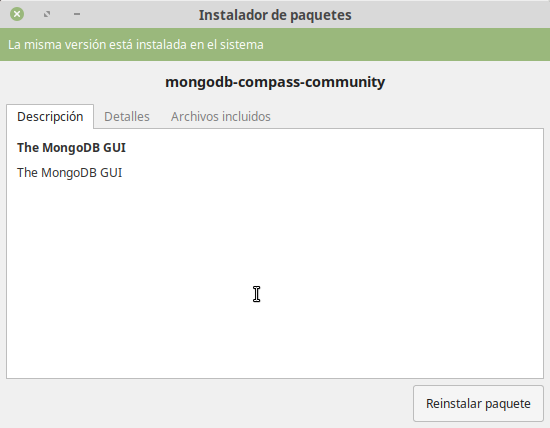
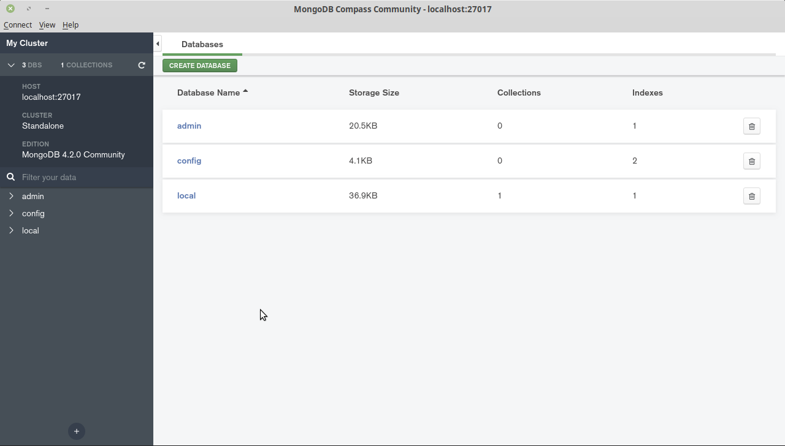

[`Fundamentos de Base de Datos`](../../Readme.md) > [`Sesión 05`](../Readme.md) > Ejemplo-02
## Conexión a MongoDB desde un cliente

### OBJETIVO
- Que el alumno instale Compass, un cliente para MongoDB
- Que el alumno se conecte a un servidor MongoDB

### REQUISITOS
1. Repositorio actualizado
1. Usar la carpeta de trabajo `Sesion-05/Ejemplo-02`

### DESARROLLO
1. Entra a la [Página Oficial de Compass](https://www.mongodb.com/download-center/compass)

   1. Selecciona la versión __Community Edition Stable__
   1. Secciona tu sistema operativo (Linux, Mac o Windows)
   1. Dá click en __Download__

1. Instalación para GNU/Linux

   1. Ejecuta el instalador dando doble click en el archivo `.deb`, `.rpm` o el que hayas descargando para tu distribución de Linux.
   1. Se abrirá el asistente de instalación de software, entonces da click en el botón __Instalar paquete__
      
   1. Terminar la instalación y cerrar las ventanas
   1. Para iniciar __Compass__ buscarlo en la lista de aplicaciones y dar click

1. Instalación para Windows

   1. Ejecuta el instalador dando doble click en el archivo descargado
   1. Seguir las instrucciones y seleccionar las opciones por omisión
   1. Una vez instalado __Compass__ lanza una ventana preguntando las configuración de privacidad y actualización, las cuales se pueden dejar tar cual o se pueden deseleccionar todas, por favor decida cuales son más convenientes para tí.
   1. Si __Compass__ no se ha iniciado aún, inicialo desde tu lista de aplicaciones en el menú Inicio.

1. Instalación y ejecución para MacOS

   1. Arrastra el archivo con extensión `.dmg` a la carpeta `Applications`, entonces espera a que termine el proceso de instalación.
   1. Inicia __Compass__ desde la carpeta de `Applications` y en caso de solicitar permisos, autoriza la ejecución de aplicaciones bajadas de Internet.

1. Después de ejecutar __Compass__ se deberá contar con una ventana similar a la siguiente.

   

   El valor tanto para __Hostname__ (localhost) y __Port__ (27017), que son los valores por omisión, son los correctos, así que se presiona el botón __CONNECT__ que hará que __Compass__ se conecte a nuestro servidor local de MongoDB:

   
   Que nos muestra una lista de las bases de datos existentes
   
