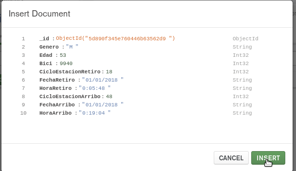
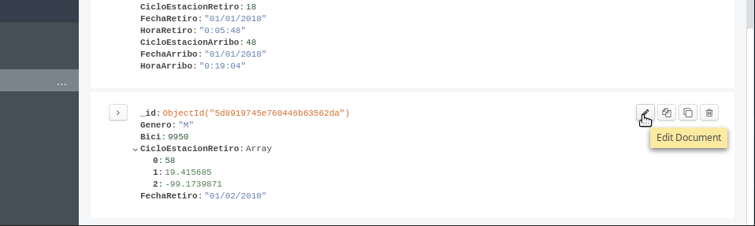
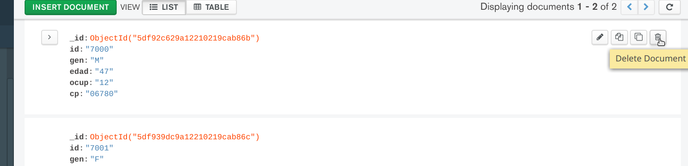
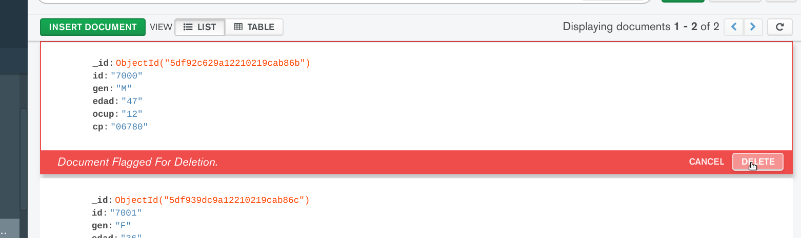
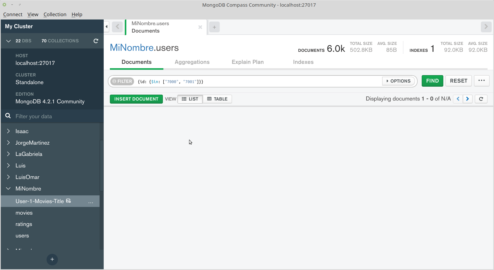

[`Fundamentos de Base de Datos`](../../Readme.md) > [`Sesión 05`](../Readme.md) > Ejemplo-03
## Realizando operaciones con Documentos

### OBJETIVO
- Que el alumno agregue __Documentos__ en una __Colección__
- Que el alumno modifique __Documentos__ en una __Colección__
- Que el alumno elimine __Documentos en una Colección__
- Que el alumno comprenda la estructura de documentos de una base de datos __MongoDB__

### REQUISITOS
1. Repositorio actualizado
1. Usar la carpeta de trabajo `Sesion-05/Ejemplo-03`
1. __MongoDB Compass__ iniciado y conectado al servidor de MongoDB
1. Base de datos __MiNombre__ y Colecciones `users`, `movies` y `ratings` creadas

### DESARROLLO
Hasta el momento se han creado Bases de datos, Colecciones e Importado datos en MongoDB, sin embargo es importante comprender que MongoDB es una base de datos NoSQL y que en lugar de trabajar con registros, trabaja con Documentos en formato JSON.

A continuación se realizaran las operaciones de agregar, modificar y eliminar un documento JSON en una Colección.

1. Para agregar un Documento, dar click sobre la base de datos __MiNombre__, luego dar click sobre la colección __users__ y entonces dar click sobre el botón __INSERT DOCUMENT__:

   
   Esto abrirá un diálogo que nos permite agregar los campos que conformarán nuestro documento en notación JSON (¿qué es un documento o archivo en formato JSON?)

   Supongamos que tenemos los siguientes datos en formato CSV de un nuevo usuario:
   ```csv
   7000,M,47,12,06780
   ```
   Para agregar estos datos, se necesitan reescribir en formato JSON, lo que significa crear un Objeto que se describe usando parejas __Llave:Valor__.

   Para una referencia completa de como se construye un documento JSON se puede consultar en https://www.json.org/json-en.html

   En nuestro caso, los valores ya los tenemos, pero las llaves no, por esa razón es necesario que nuestro archivos en CSV cuente con nombre de columnas, ya que estos serán usados como las llaves, así que nuestro datos en CSV necesitan complementarse como sigue:
   ```csv
   id,gen,edad,ocup,cp
   7000,M,47,12,06780
   ```
   Y entonces el correspondiente formato JSON será:
   ```json
   {
     id:"7000",
     gen:"M",
     edad:"47",
     ocup:"12",
     cp:"06780"
   }
   ```
   Ahora regresemos a __MongoDB Compass__ y agregemos estos campos:

   
   
   Aunque en el diálogo se puede elegir el tipo de dato correcto para cada caso, todos los campos se importan como cadenas de texto porque así es como se realiza en la importación de datos. Nota que el campo `_id` no es necesario agregarlo, ya que __MongoDB Compass__ lo agrega de forma automática y es la manera en que se crea un identificador único para cada Documento.

   Al final presionar el botón __INSERT__

   Para poder observar nuestro documento en la lista hay que realizar un filtro similar al `SELECT-WHERE` de SQL para imprimir el documento con `id=7000`, esto se realiza agregando lo siguiente en la barra de `FILTER`:
   ```json
   {id:"7000"}
   ```
   Y se presiona la tecla `ENTER` o se da click en el botón `FIND` con lo que se obtiene el siguiente resultado:

   

1. Como __MongoDB__ es una base de datos __NoSQL__ se pueden insertar documentos que no tengan la misma estructura y además cada campo puede ser un tipo de dato complejo como un array o un objeto.

   Agregar el siguiente documento JSON de un usuario:
   ```json
   {
     id:"7001",
     gen:"F",
     edad:"36",
     ocup:"10",
     cp:"06780",
     pelisValoradas: [
       "One Flew Over the Cuckoo's Nest (1975)",
       "James and the Giant Peach (1996)",
       "My Fair Lady (1964)"       
     ]
   }
   ```

   
   Observa como en `MongoDB` cada campo puede ser un arreglo y cada elemento a su vez también puede ser un arreglo o un objeto y así indefinidamente.

   Luego de presionar el botón __INSERT__ modifica la barra de `FILTER` con lo siguiente para observar nuestros dos documentos agregados:
   ```json
   {id: {$in: ["7000", "7001"]}}
   ```
   El operador `$in: [opción1, opción2]` es similar al operador `IN` en SQL y en este caso imprime los documentos donde el campo `id` está en la lista de opciones.

   

1. Para modificar un documento, dar click sobre el botón __Edit Document__

   
   Después de dar click en el botón __Edit Document__ el documento cambia a estado editable y se puede modificar el contenido del documento.

   Agregar el siguiente título de película a la lista de `pelisValoradas`:
   ```json
   Erin Brockovich (2000)
   ```

   
   Da click sobre el botón __UPDATE__ para guardar los cambios.

1. La operación para eliminar documentos ya se ocupó anteriormente y se realiza mediante el botón __Delete Document__, así que elimina los dos documentos creados

   

   

   

__Misión cumplida__
