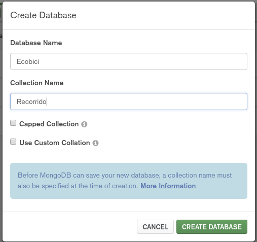
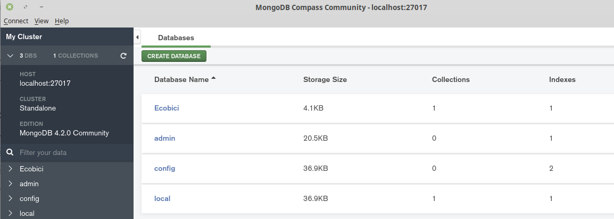
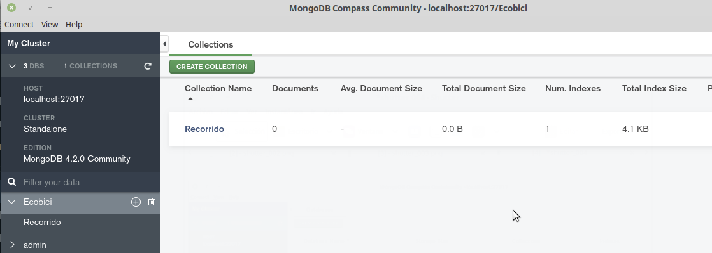
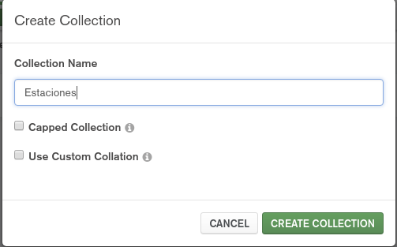
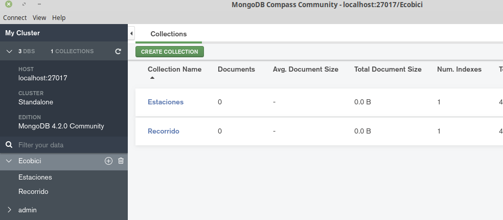

[`Fundamentos de Base de Datos`](../../Readme.md) > [`Sesión 05`](../Readme.md) > Ejemplo-03
## Configuración de la base de datos

### OBJETIVO
- Que el alumno cree y use una base de datos en MongoDB
- Que el alumno cree nuevas colecciones en la base de datos

### REQUISITOS
1. Repositorio actualizado
1. Usar la carpeta de trabajo `Sesion-05/Ejemplo-03`
1. __Compass__ iniciado y conectado al servidor local de MongoDB

### DESARROLLO
1. En la ventana de __Compass__ presionar el botón __CREATE DATABASE__ y crear la base de datos __Ecobici__ con la colección __Recorrido__, recuerda que si no se agrega una colección a la base de datos, esta no será creada.

   
   Una vez llenado los datos, presionar el botón __CREATE DATABASE__

   Se deberá ver nuestra nueva base de datos en la lista:
   

1. Para hacer uso de la base de datos __Ecobici__ dar click sobre el nombre y se obtendrá la lista de colecciones disponibles:

   
   Si eres usuario de bases de datos SQL, considera una __Colección__ como el equivalente a una __Tabla__.

1. Para crear una nueva colección llamada __Estaciones__, presionar el botón __CREATE COLLECTION__ y llenar los datos como se muestra a continuación:

   
   Al terminar presionar el botón __CREATE COLLECTION__

   Se deberá contar con la siguiente lista de colecciones:
   
   
