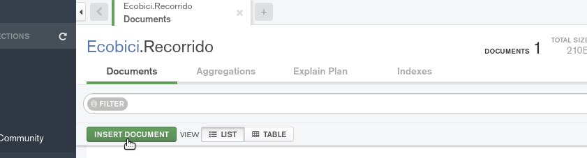
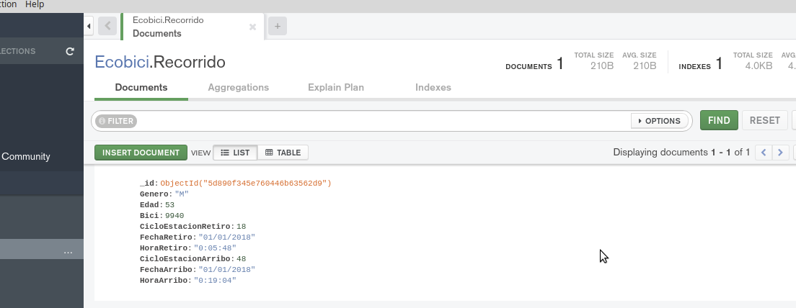
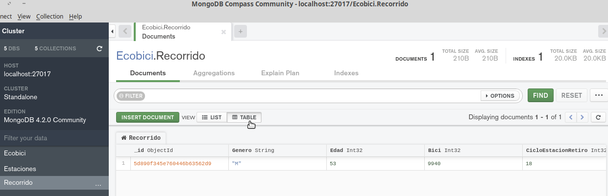
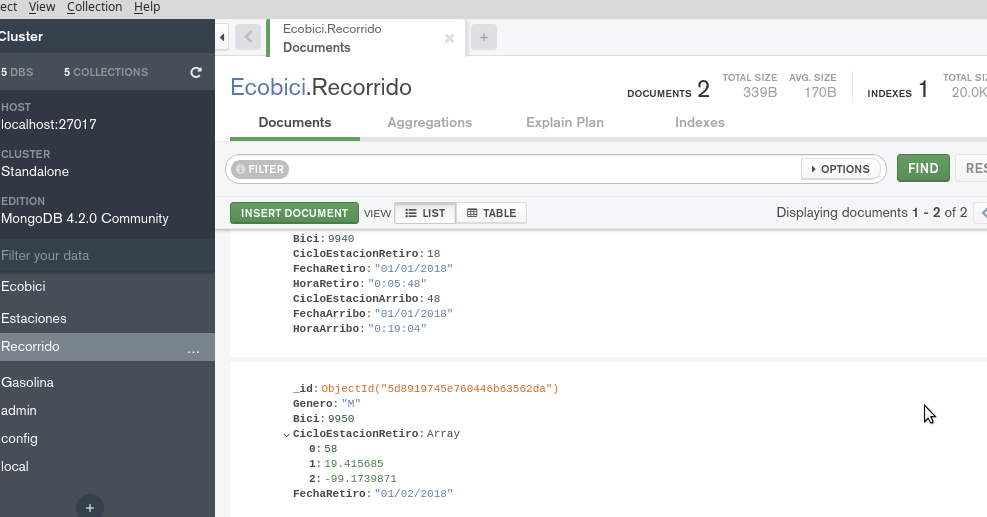
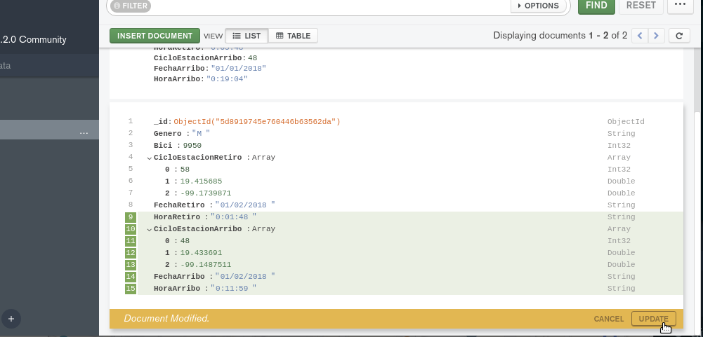
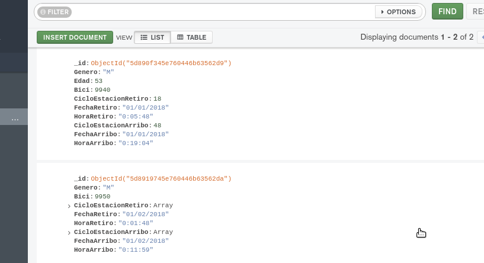
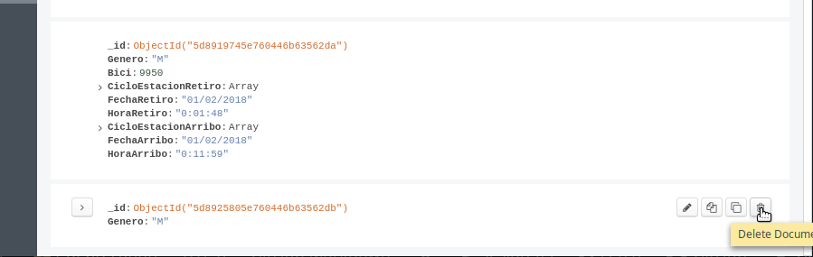
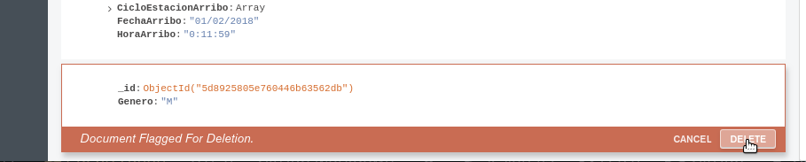

[`Fundamentos de Base de Datos`](../../Readme.md) > [`Sesión 05`](../Readme.md) > Ejemplo-04
## Configuración de la base de datos

### OBJETIVO
- Que el alumno cree __Documentos__ en una __Colección__
- Que el alumno modifique __Documentos__ en una __Colección__
- Que el alumno elimine __Documentos en una __Colección__

### REQUISITOS
1. Repositorio actualizado
1. Usar la carpeta de trabajo `Sesion-05/Ejemplo-04`
1. __Compass__ iniciado y conectado al servidor local de MongoDB
1. Base de datos __Ecobici__ creada

### DESARROLLO
1. Para crear un documento, dar click sobre la base de datos __Ecobici__, luego dar click sobre la colección __Recorrido__ y entonces dar click sobre el botón __INSERT DOCUMENT__:

   
   Esto abrirá un diálogo que nos permite agregar los datos o campos u objetos que conformarán nuestro documento en notación JSON

   
   Agregar los datos que se muestran en la imagen, teniendo cuidado de elegir el tipo de dato correcto para cada caso. Nota que el campo `_id` no es necesario agregarlo, pero __Compass__ lo agregar por nosotros para ya que es una buena práctica contar con un identificar único para cada registro.

   Al final presionar el botón __INSERT__ lo que deberá mostrar el documento ya inserado en la colección:

   

   O en forma tabular
   

1. Como __MongoDB__ es una base de datos __NoSQL__ se pueden insertar documentos que no tengan la misma estructura y además cada campo puede ser un array o un objeto, así que se creará un documento donde el campo de la __CicloEstacion__ es un array conteniendo el número de la __CicloEstacion__, así como su geolocalización en longitud y latitud.

   
   Luego de precionar el botón __INSERT__ se obtiene la lista de los dos documentos insertados

   

1. Para modificar un documento, dar click sobre el botón __Edit Document__

   
   Después de dar click en el botón __Edit Document__ el documento cambia a estado editable y se puede modificar el contenido del documento, en este caso agregue los campo faltantes:

   
   Agregar los datos faltantes que se muestran y dar click sobre el botón __UPDATE__ para guardar los cambios obteniendo la nueva lista de documentos

   

1. La operación para eliminar documentos se realiza mediante el botón __Delete Document__, pero primero crea un documento con sólo el campo de __Genero: M__ y luego procede a eliminarlo:

   
   Después de presionar el botón __Compass__ no muestra una advertencia de confirmación, dando click en el botón __DELETE__ para eliminar el documento de forma definitiva

   
