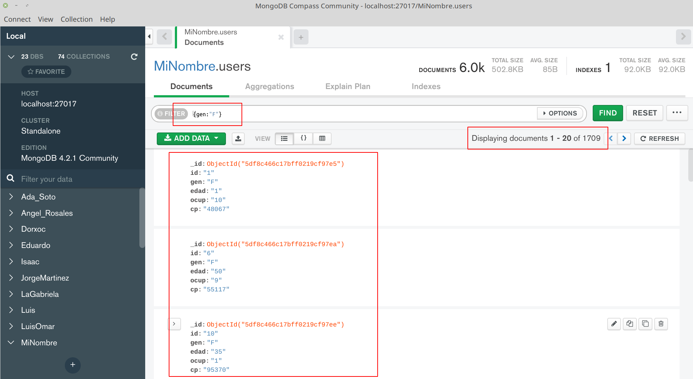
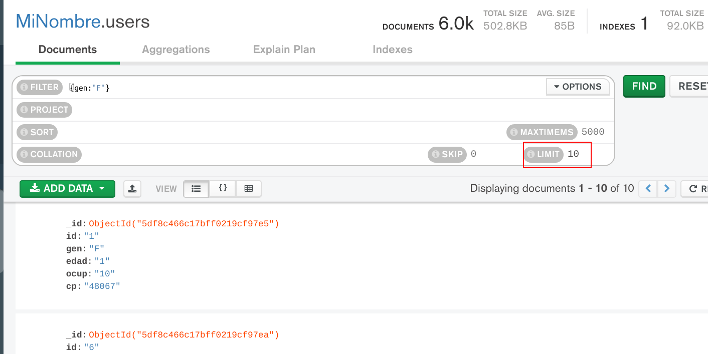
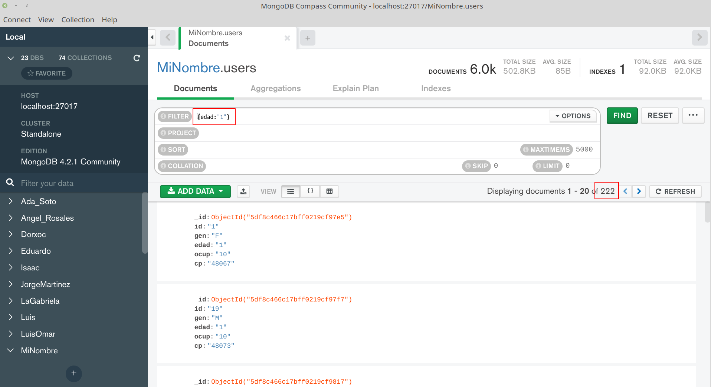
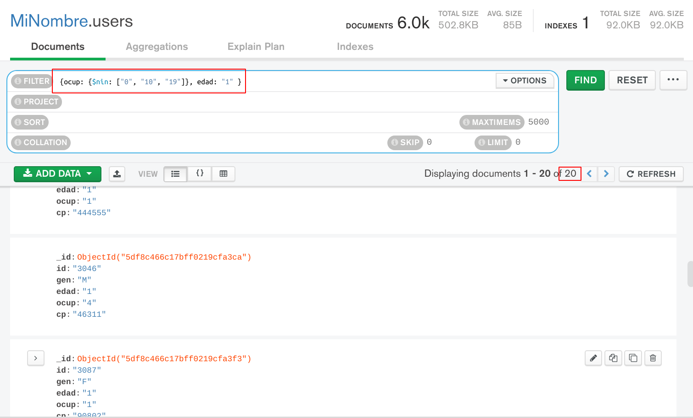

[`Fundamentos de Base de Datos`](../../Readme.md) > [`Sesión 05`](../Readme.md) > Ejemplo-04
## Filtrando Documentos en una Colección

### OBJETIVO
- Que el alumno conozca la forma de filtrar Documentos en una Colección
- Que el alumno obtenga resultados a preguntas generadas

### REQUISITOS
1. Repositorio actualizado
1. Usar la carpeta de trabajo `Sesion-05/Ejemplo-04`
1. __MongoDB Compass__ iniciado y conectado al servidor de MongoDB
1. Base de datos __MiNombre__ y Colecciones `users`, `movies` y `ratings` creadas

### DESARROLLO
Se comenzará a crear algunas consultas similares a las creadas en SQL pero usando las herramientas de MongoDB usando el mismo conjunto de datos, más adelante se harán usado de datos no estructurados.

1. La primer consulta consiste en obtener la lista de todos los usuarios con género femenino de la colección `users`, limitar el resultado a 10 documentos para agilizar la obtención del resultado:

   En la barra de `FILTER` se coloca la siguiente expresión:
   ```json
   {gen: "F"}
   ```
   Esta es una condición que indica seleccionar todo los documentos donde el campo `gen` tenga el valor `F`, el resultado es como el siguiente:
   

   En este caso con una sola consulta se ha obtenido que el número de documentos con género femenino es de 1709, también se puede ver una muestra del resultado, donde se puede corroborar que todos los documentos tienen género `F`

   Ahora sólo falta limitar el número de documentos, para ello se da click en el botón `OPTIONS` y luego se ajusta el valor de `LIMIT` a 10 y se presiona el botón de `FIND` obteniendo el siguiente resultado:
   

1. Obtener todos los usuarios que son menor de edad e indicar cuantos son.

   Del archivo `README` se obtiene que son todos los usuarios que en el campo `edad` tiene valor de 1, para realizar comparaciones en MongoDB los operadores son `$eq` (igual que), `$gt` (mayor que), `$gte` (mayor o igual que), `$lt` (menor que), `lte` (menor o igual que), aunque para este caso es suficiente con obtener todos los usuarios cuya edad sea 1, así que en la barra `FILTER` se escribe:
   ```json
   {edad: "1"}
   ```
   Notar que se ha colocado el valor de "1" encerrado entre comillas para indicar que es texto, ya que así es como está almacenada la información debido a la importación. El resultado obtenido es:
   

   Se obtiene un total de 222 usuarios.

1. Ahora vamos a mezclar las dos consultas anteriores, así que se desea obtener la lista de todos los usuarios menores de edad y con género femenino.

   Para realizar una operación `AND` en la barrá de `FILTER` se pueden colocar más de dos condiciones separadas por coma, así que la consulta queda como sigue:
   ```json
   {gen:"F", edad:"1"}
   ```
   El resultado es el siguiente:
   

   Por lo que se cuentan con 78 usuarios que cumplen ambas condiciones.

1. Se desea obtener la lista de todos los usuarios cuya ocupación __no__ es _Estudiante_ o _Desempleado_ o _Otro_ y que además son menores de edad e indicar cuantos son.

   Primeramente del archivo `README` se obtiene que para _Estudiante_ y _Desempleado_ los códigos de ocupación son 0, 10 y 19 entonces se puede hacer uso del operador `$nin` (NOT IN) y el operador `AND` haciendo uso de la coma, quedando el filtro siguiente:
   ```json
   {ocup {$nin: ["0", "10", "19"]}, edad: "1"}
   ```
   El resultado sería el siguiente:
   

   Por lo que se tienen sólo 20 usuarios que cumplen estas condiciones.   

__Misión cumplida__
