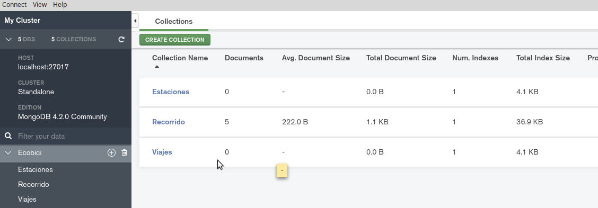
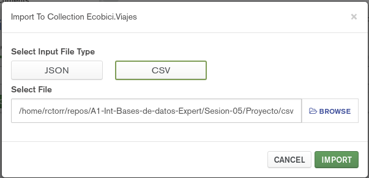
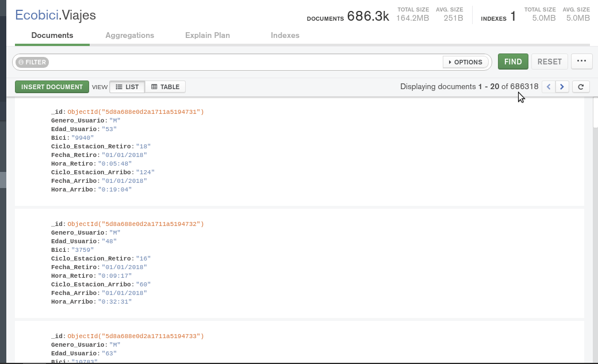
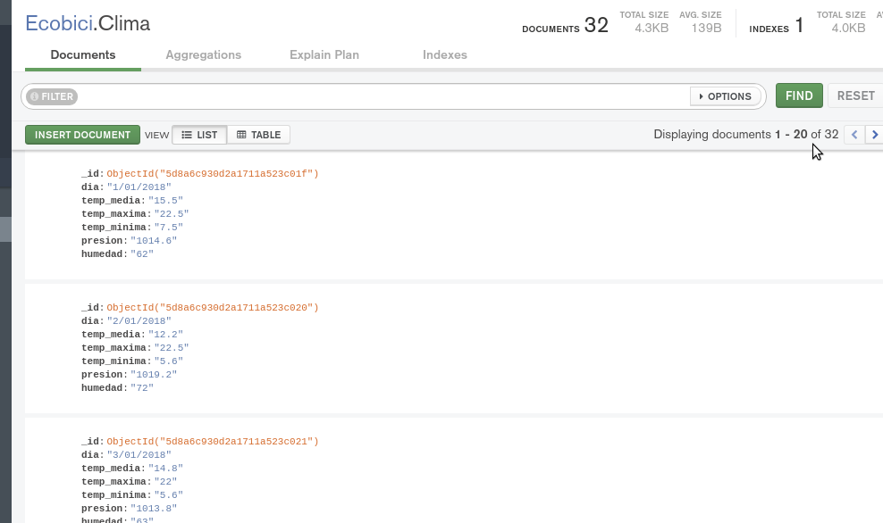

[`Fundamentos de Base de Datos`](../../Readme.md) > [`Sesión 05`](../Readme.md) > Proyecto
## Configuración de la base de datos

### OBJETIVO
- Que el alumno importe conjuntos de datos a una Colección.

### REQUISITOS
1. Repositorio actualizado
1. Usar la carpeta de trabajo `Sesion-05/Proyecto`
1. __Compass__ iniciado y conectado al servidor local de MongoDB
1. Base de datos __Ecobici__ creada

### DESARROLLO
1. Para poder importar datos en formato csv o json es necesario contar con una colección a donde agregarlos, así que primero se crea la colección __Ecobici.Viajes__

   
   Se selecciona la nueva colección.

1. Importando los datos desde la opción del menú `Collection` > `Import Data`, lo que abre el siguiente diálogo:

   
   Dar click en el botón de __CSV__, seleccionar el archivo `Proyecto/csv/ecobici-viajes-enero2018.csv` y después presionar el botón __IMPORT__

   
   Observar que sólo se muestran 20 de 686318 y no se ha presentado ningún error.

   Nota: En caso de que un error se presente al importar los datos, se recomienda eliminar la colección, crearla de nuevo y realizar nuevamente la importación de datos.

1. Realiza el mismo procedimiento para el archivo `Proyecto/csv/clima-enero2018.csv` importándolo en la colección __Clima__. El resultado deberá de ser similar al siguiente:

   
   Notar que deberán de existir 32 documentos tras la importación.
   
