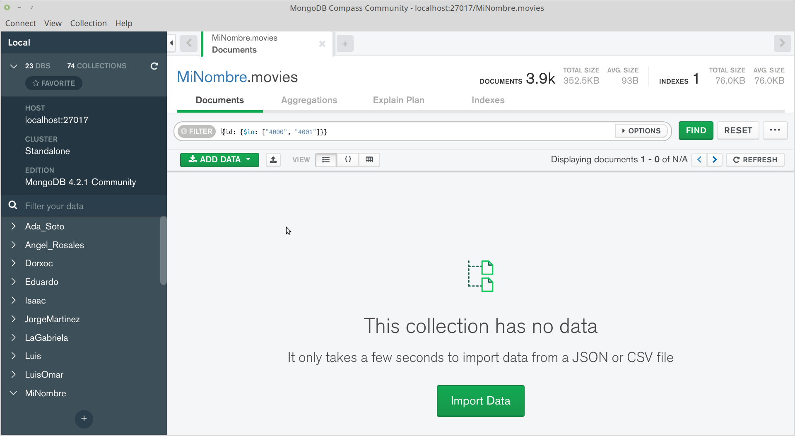

[`Fundamentos de Base de Datos`](../../Readme.md) > [`Sesión 05`](../Readme.md) > Reto-03
## Realizando operaciones con Documentos

### OBJETIVOS
- Que el alumno comprenda la estructura de documentos de una base de datos __MongoDB__
- Que el alumno se familiarice con la notación JSON

### REQUISITOS
1. Repositorio actualizado
1. Usar la carpeta de trabajo `Sesion-05/Reto-03`
1. __MongoDB Compass__ iniciado y conectado al servidor de MongoDB
1. Base de datos __MiNombre__ y Colecciones `users`, `movies` y `ratings` creadas

### DESARROLLO
A continuación se realizaran algunas operaciones de agregar, modificar y eliminar un documento JSON en una Colección.

1. Agregar los siguientes registros en formato CSV a la Colección `movies`

   ```csv
   4000,Avengers: Endgame (2019),Fantasy|Sci-Fi
   4001,Glass (2019),Drama|Fantasy
   ```
   Incluyendo nombres de columnas quedaría:
   ```csv
   id,titulo,genres
   4000,Avengers: Endgame (2019),Fantasy|Sci-Fi
   4001,Glass (2019),Drama|Fantasy
   ```
   Y entonces el correspondiente formato JSON será:
   ```json
   {
     id:"4000",
     titulo:"Avengers: Endgame (2019)",
     genres:"Fantasy|Sci-Fi"
   }
   {
     id:"4001",
     titulo:"Glass (2019)",
     genres:"Drama|Fantasy"
   }
   ```
   Ahora ir a __MongoDB Compass__ y agregar ambos documentos:

   

   Al final presionar el botón __INSERT__

   Para poder observar nuestros documentos en la lista hay que realizar un filtro
   ```json
   {id: {$in: ["4000", "4001"]}}
   ```

   

1. Modificar el documento con `id=4001` en la Colección `movies` para que contenga la siguiente información:

   ```json
   {
     id:"4001",
     titulo:"Glass (2019)",
     genres:"Drama|Fantasy",
     valoraciones: [
       {
         userid: "1563",
         movieid: "4001",
         rating: "4"
       },
       {
         userid: "434",
         movieid: "4001",
         rating: "5"
       }
     ]
   }
   ```
   Luego de presionar el botón __INSERT__ la lista de los dos documentos deberá de ser la siguiente:

   
   Trabajar con Documentos JSON después de trabajar con SQL puede ser un poco confuso, así que siéntete libre de solicitar ayuda si algo no queda según lo requerido.

1. Finalmente elimina ambos documentos, quedando la lista de documentos final como la siguiente:

   

__Misión cumplida__
