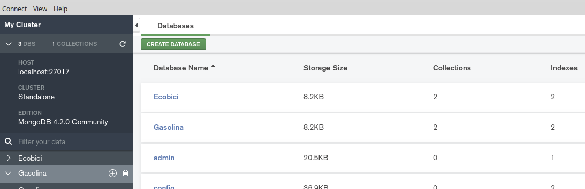
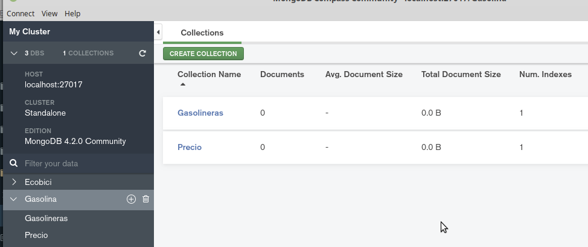

[`Fundamentos de Base de Datos`](../../Readme.md) > [`Sesión 05`](../Readme.md) > Reto-03
## Configuración de la base de datos

### OBJETIVO
- Que el alumno cree y use una base de datos en MongoDB
- Que el alumno cree nuevas colecciones en la base de datos

### REQUISITOS
1. Repositorio actualizado
1. Usar la carpeta de trabajo `Sesion-05/Reto-03`
1. __Compass__ iniciado y conectado al servidor local de MongoDB

### DESARROLLO
1. Crear la base de datos con nombre __Gasolina__

   

1. Crear las colecciones __Precio__ y __Gasolineras__:

   
