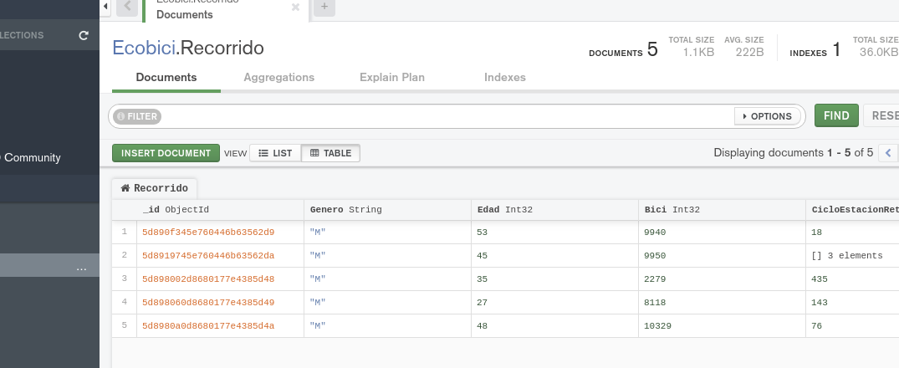

[`Fundamentos de Base de Datos`](../../Readme.md) > [`Sesión 05`](../Readme.md) > Reto-04
## Configuración de la base de datos

### OBJETIVO
- Que el alumno realice operaciones de CRUD de documentos en una __Colección__

### REQUISITOS
1. Repositorio actualizado
1. Usar la carpeta de trabajo `Sesion-05/Reto-04`
1. __Compass__ iniciado y conectado al servidor local de MongoDB
1. Base de datos __Ecobici__ creada

### DESARROLLO
1. Realizar las operaciones de agregar, modificar o eliminar documentos a una colección para agregar los siguiente documentos a la colección __Ecobici.Recorrido__. El orden de los campos es:

   1. Genero
   1. Edad
   1. Bici
   1. CicloEstacionRetiro
   1. FechaRetiro
   1. HoraRetiro
   1. CicloEstacionArribo
   1. FechaArribo
   1. HoraArribo

   ```csv
   M,35,2279,435,02/01/2018,0:08:32,420,02/01/2018,0:15:37
   M,27,8118,143,02/01/2018,0:08:45,143,02/01/2018,0:31:53
   M,48,10329,76,02/01/2018,0:12:09,76,02/01/2018,0:54:27
   ```
   El resultado debe ser similar al siguiente:

   
   
