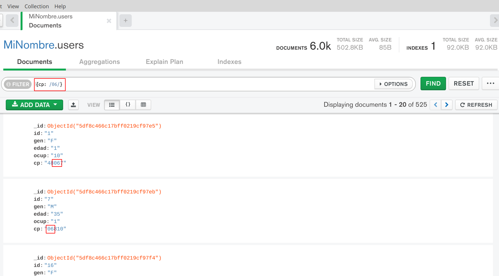
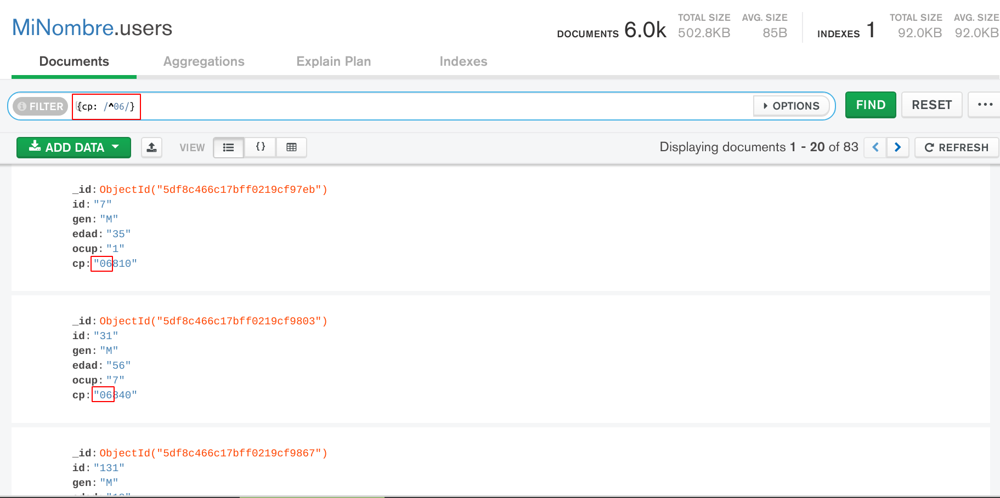
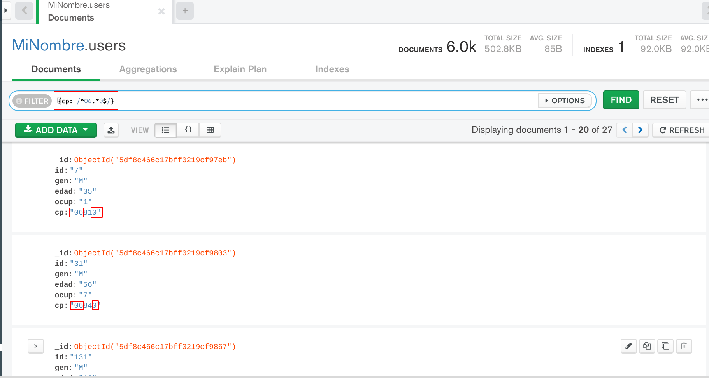
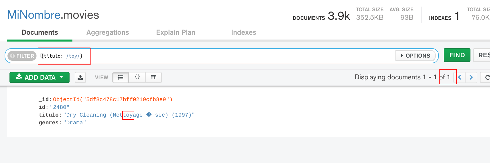
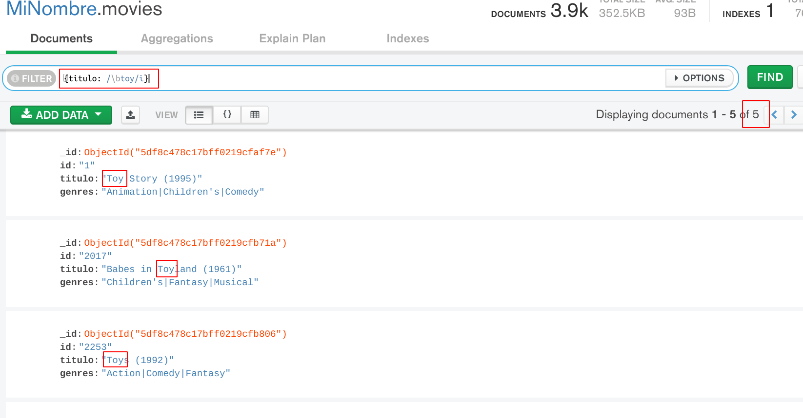
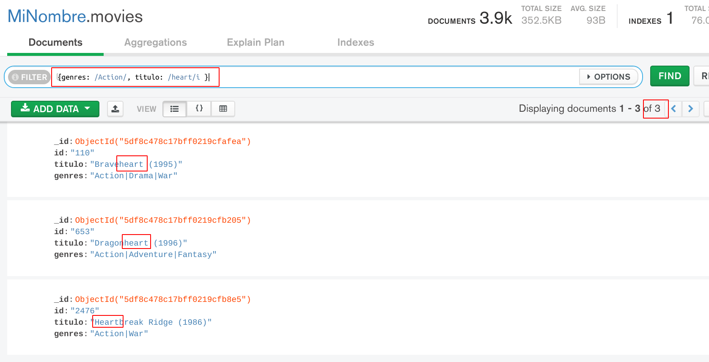

[`Fundamentos de Base de Datos`](../../Readme.md) > [`Sesión 06`](../Readme.md) > Ejemplo-01
## Realizando consultas usando expresiones regulares en MongoDB

### OBJETIVO
- Que el alumno aprenda como usar expresiones regulares en la creación de consultas.
- Que el alumno responda a preguntas donde involucre búsqueda de cadenas de texto.

### REQUISITOS
1. Repositorio actualizado
1. Contar con la base de datos __MiNombre__ y las colecciones __users__, __movies__ y __ratings__

### DESARROLLO
En el proyecto de la sesión anterior se realizó un reto para una primera consulta utilizando expresiones regulares, ahora se describirán y usarán a detalle.

1. Imprimir la lista de todos los usuarios de la colección `users` donde su código postal inicie con `06` y terminen en `0`.

   El uso de expresiones regulares en MongoDB se realiza mediante el uso de dos diagonales, por ejemplo iniciamos imprimiendo la lista de todos los documentos que tengan `06` en el código postal, el código json en la barra `FILTER` será:
   ```json
   {cp: /06/}
   ```
   El resultado obtenido es el siguiente:
   

   Observar como la cadena `06` aparece en cualquier parte del código postal, por lo que es similar a haber escrito `/.*06.*/` (recuerda que punto indica que tiene que hacer cualquier caracter y asterisco indica que el carecter anterior se repite cero o más veces), así que si se requiere que aparezca en el inicio, se tiene que hacer uso del operador `^texto` (circunflejo) para que `texto` sólo aparezca en el inicio, así que para imprimir la lista de todos documentos donde el código postal inicia con `06` sería:
   ```json
   {cp: /^06/}
   ```
   El resultado obtenido es:
   

   Ahora todos los documentos ya incluyen `06` al inicio del código postal, así que ahora sólo se seleccionan los documentos donde el código postal termine en `0`, para ello se usará el operador `texto$` para que texto aparezca al final del campo, así que el filtro se modifica a:
   ```json
   {cp: /^06.*0$/}
   ```
   El resultado obtenido es:
   

   El total de documentos obtenidos es de 27.

1. Imprimir la lista de películas cuya temática esté relacionada con _juguete_ (toy) de la colección `movies`.

   La primer aproximación es usar el siguiente filtro:
   ```json
   {titulo: /toy/}
   ```
   El resultado es:
   

   Se observa que el único documento encontrado incluye el texto `toy` como parte de una palabra, así que se ahora se hará uso del caracter `\b` de la forma `\btoy` para que sólo incluya las palabras que inicien con `toy` y como también se desea incluir mayúsculas se usa la opción `i` (case-insensitive), entonces el filtro queda como sigue:
   ```json
   {titulo: /\btoy/i}
   ```
   El resultado obtenido es el siguiente:
   

   __Nota:__ Las expresiones regulares usadas por MongoDB siguien las mismas reglas que las expresiones regulares en JavaScript, para una referencia de todas las opciones, modificadores y caracteres se puede consultar en:
   - https://www.w3schools.com/js/js_regexp.asp

   En el resultado se puede observar que todos los títulos ahora si tienen que ver con juguetes y se obtiene que sólo son 5 películas.

1. Finalmente se desea imprimir la lista de todas la películas cuyo género sea de acción y en el título tengan la palabra corazón (heart).

   Para la solución se hace uso de dos expresiones regulares, una para el título y otra para el género, sólo hay que tener en cuenta que en el título se necesita que incluya mayúsculas y minúsculas, así que agrega la opción `i`:
   ```json
   {genres: /Action/, titulo: /heart/i }
   ```
   Dando el resultado:
   
   Dónde se observa como todos los documentos son de acción e incluyen corazón en el título, dando un total de 3 películas.

__Misión cumplida__
