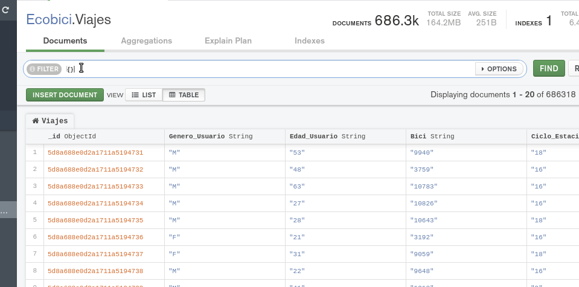
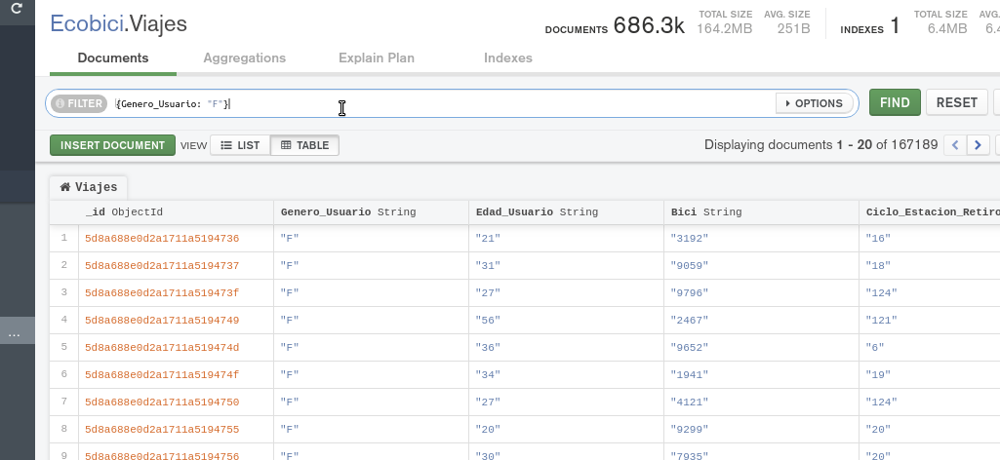
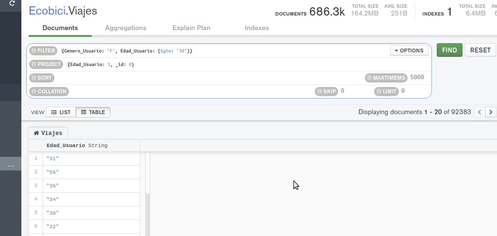

[`Fundamentos de Base de Datos`](../../Readme.md) > [`Sesión 06`](../Readme.md) > Ejemplo-01
## Consultando nuestra base de datos MongoDB

### OBJETIVO
- Que el alumno aprenda como realizar consultas básicas en MongoDB

### REQUISITOS
1. Repositorio actualizado
1. Usar la carpeta de trabajo `Sesion-06/Ejemplo-01`
1. Contar con la base de datos __Ecobici__ y las colecciones __Clima__ y __Viajes__

### DESARROLLO
1. La función __find__ es la que permite realizar consultas en MongoDB (equivalente al SELECT en SQL) pasando un documento como parámetro, así que la primera consulta es mostrar todos los documentos de la colección __Viajes__

   En SQL esto se realiza con `SELECT * FROM Viajes` y en MongoDB esto se realiza con:
   ```json
   {}
   ```
   Usando un documento vacío `{}` en la barra de búsqueda en __Compass__, el resultado debe ser similar a:

   
   Se puede observar que con o sin el documento `{}` vacio se muestran todos los documentos de la colección.

1. Listar todos los documentos cuyo género es Femenino

   En SQL es equivalente a `SELECT * FROM Viajes WHERE Genero_Usuario="F"` y en MongoDB sería:
   ```json
   {Genero_Usuario: "F"}
   ```

   El resultado será como el siguiente:
   

1. Obtener la lista de todas las edades de los usuarios en la colección __Viajes__ realizados por una mujer y con edad mayor a 30 años.

   En SQL el equivalente es `SELECT Edad_Usuario FROM Viajes WHERE Genero_Usuario="F" AND Edad_Usuario > 30`.

   Para realizar la misma consulta en __Compass__ se hará uso de __Filter__
   ```json
   {Genero_Usuario: "F", Edad_Usuario: { $gte: "30"}}
   ```
   La coma hace la función de operador AND permitiendo aplicar dos operaciones

    y de __Proyect__
   ```json
   {Edad_Usuario: 1, __id: 0}
   ```
   Recuerda que 1 indica que el campo presente y 0 no presente.

   Obteniendo un resultado similar a:
   
