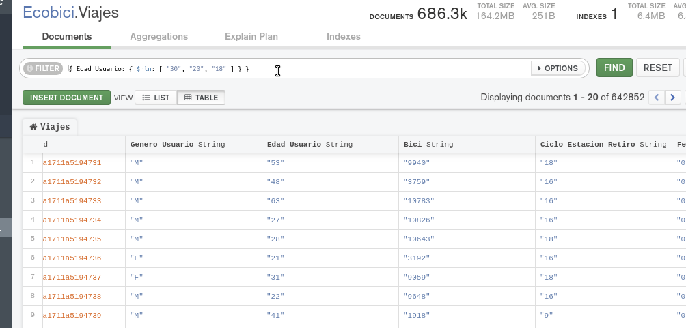
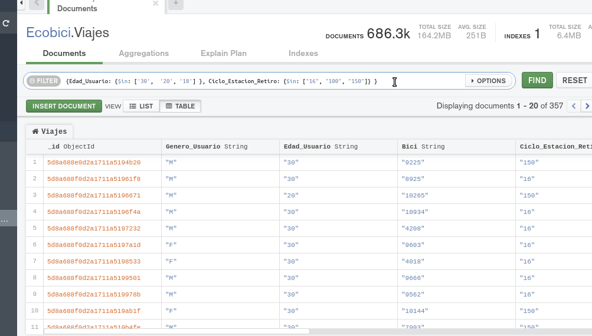
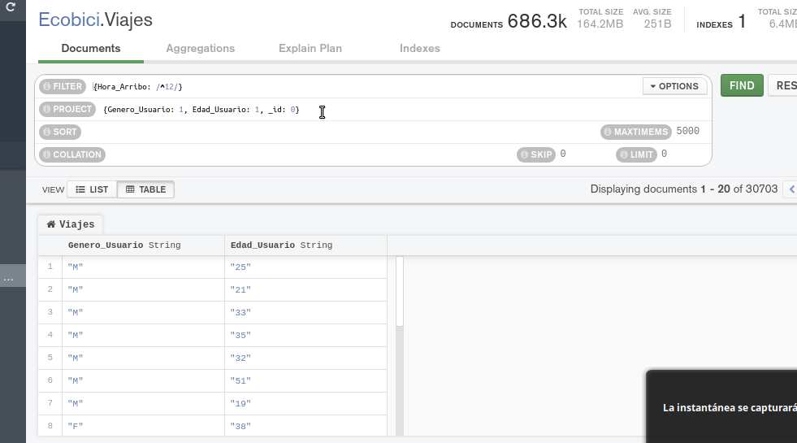

[`Fundamentos de Base de Datos`](../../Readme.md) > [`Sesión 06`](../Readme.md) > Ejemplo-02
## Filtrado avanzado en MongoDB

### OBJETIVO
- Que el alumno conozca como operadores en las consultas

### REQUISITOS
1. Repositorio actualizado
1. Usar la carpeta de trabajo `Sesion-06/Ejemplo-02`
1. Contar con la base de datos __Ecobici__ y las colecciones __Clima__ y __Viajes__

### DESARROLLO
1. Uso del operador __$nin__ similar al operador __NOT IN__ en SQL, en este caso se usará para obtener la lista de todos los viajes donde el usuario no tenga edades de 35, 20 y 18.

   El filtro a aplicar sería el siguiente:
   ```json
   {Edad_Usuario: {$nin: ["30", "20", "18"] } }
   ```
   El resultado será:
   

1. Uso del operador __$in__ similar a __IN__ en SQL para seleccionar todos los viajes donde los usuarios tengan edades de 30, 20 y 18, pero además que hayan tomado bici de las ciclo estaciones 16, 100 y 150.

   El filtro a aplicar en __Compass__ sería:
   ```json
   {Edad_Usuario: {$in: ['30',  '20', '18'] }, Ciclo_Estacion_Retiro: {$in: ["16", "100", "150"]} }
   ```
   En este caso, se ha aplicado el operador __$in__ dos veces y el operador __AND__ una vez. El resultado debe ser similar al siguiente:
   

1. Combinando __expresiones regulares__ con el operador __$in__ para obtener la lista de el genero y edad de todos los usuarios cuyos viajes terminaron a las 12 hrs con cualquier fracción de minutos.

   El filtro usado es el siguiente:
   ```json
   {Hora_Arribo: /^12/}
   ```

   y la proyección es:
   ```json
   {Genero_Usuario: 1, Edad_Usuario: 1, _id: 0}
   ```

   El resultado debe ser similar al siguiente:
   
