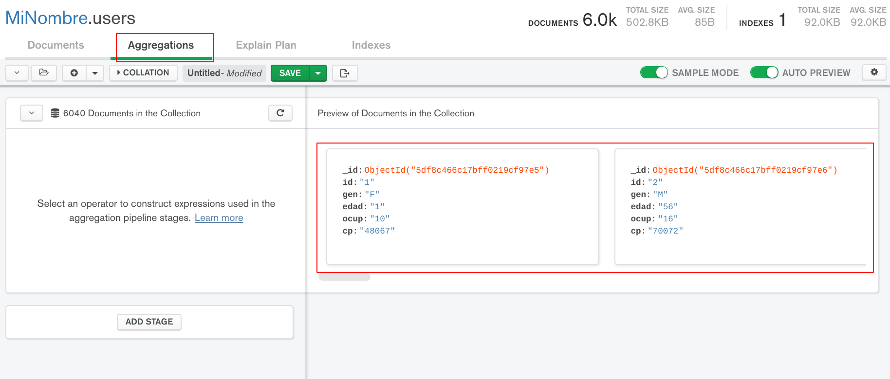
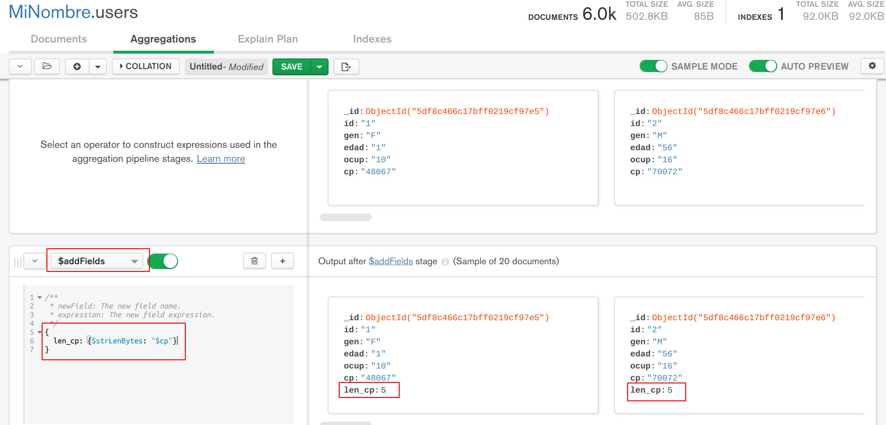
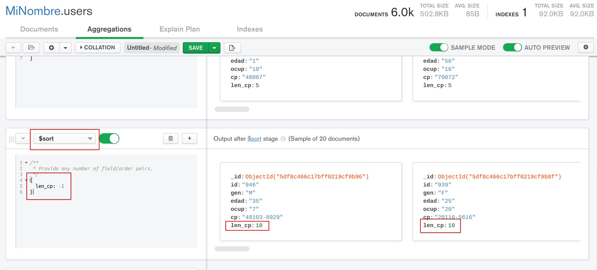

[`Fundamentos de Base de Datos`](../../Readme.md) > [`Sesión 06`](../Readme.md) > Ejemplo-02
## Ordenando y guardando resultados en MongoDB

### OBJETIVO
- Obtener resultados ordenados en base a un campo
- Guardar los resultados de las consultas

### REQUISITOS
1. Repositorio actualizado
1. Contar con la base de datos __MiNombre__ y las colecciones __users__, __movies__ y __ratings__
1. MongoDB Compass conectado al Servidor con los datos proporcionados para tu grupo

### DESARROLLO
1. Haz que tu carpeta de trabajo sea `Introduccion-a-Bases-de-Datos/Sesion-06/Ejemplo-02/`
   ```console
   $ cd Introduccion-a-Bases-de-Datos/Sesion-04/Ejemplo-02
   Ejemplo-02 $
   ```

1. En la colección `users` desea conocer cuál es la longitud máxima de caracteres para el campo `cp` en todos los registros.

   Para obtener el resultado se hará uso de las `agregaciones` en MongoDB, para ello hay que dar click en la pestaña que dice `Agregations` para ver algo similar a lo siguiente:
   

   Las agregaciones se construyen mediante la agregación de capas o etapas, donde el resultado de una etapa se convierte en el conjunto de datos de la siguiente etapa, así si una etapa genera un resultado con 10 documentos, esos 10 documentos será el conjunto de datos para la siguiente etapa.

   El inicio se tiene una etapa donde están todos los documentos de la colección, así que se calculará la longitud en caracteres del campo `cp` para todos los documentos, esto se realiza agregando una nueva etapa con la función `$addfields` que nos permite agregar nuevos campos calculados a cada documento, entonces se elige `addfields` de la lista y se agrega el siguiente código:
   ```
   {
     len_cp: {$strLenBytes: "$cp"}
   }
   ```
   El resultado es el siguiente:
   

   Con `$addfields` se ha creado el nuevo campo `len_cp` obtenido usando la función `strLenBytes` que calcula el número de bytes de una cadena de texto, en este caso la cadena del campo `cp`.

   Los documentos de resultado se observa como aparece el nuevo campo `len_cp` con un valor entero indicando la longitud del campo `cp`.

   Pero se desea obtener el mayor, una forma de obtenerlo, es ordenando los resultados de mayor a menor, así que se aplica otra etapa con la función `$sort` con el siguiente código:
   ```
   { len_cp: -1 }
   ```
   Obteniendo el resultado:
   

   Donde se observa el primer documento en el campo `len_cp` con el valor de 10.


1. En el punto anterior se ha generado un resultado que incluye un nuevo campo para cada documento, pero ese resultado sólo es disponible al ejecutar la agregación, así que ahora se guardará el resultado en formato CSV en el archivo `users-lencp-desc.csv`.

   Lo primero consiste en guardar toda la agregación como una nueva colección, presionando el triángulo a la derecha del botón `SAVE` y luego seleccionando `Create a view`, lo que abre el diálogo siguiente:
   

   Se escribe el nombre de la nueva colección, en este caso `users-con-len_cp`, luego se da click en el botón `CREATE` lo que creará una nueva sección con el nombre de la colección:
   

   Ahora todos los documentos tiene el nuevo campo `len_cp`.

   Para guardar la colección ir al menú `Collection / Export Collection` lo que abre el diálogo siguiente:
   

   Donde se selecciona el formato CSV y la carpeta y nombre del archivo donde se guardarán los resultados, se ha elegido la siguiente `Sesion-06/Ejemplo-02/users-lencp-desc.csv`

   Se presiona el botón `EXPORT` para que se exporten los datos.

   Para validar los datos exportados abrir una terminal (git bash en windows) y cambiarse a la carpeta `Sesion-06/Ejemplo-02/` y entonces ejecutar el comando:
   ```console
   Ejemplo-02 $ less users-lencp-desc.csv
   _id,id,gen,edad,ocup,cp,len_cp
   ObjectId("5df8c466c17bff0219cf9885"),161,M,45,16,98107-2117,10
   ObjectId("5df8c466c17bff0219cf98cd"),233,F,45,20,37919-4204,10
   ObjectId("5df8c466c17bff0219cf9909"),293,M,56,1,55337-4056,10
   ObjectId("5df8c466c17bff0219cf99ae"),458,M,50,16,55405-2546,10
   ObjectId("5df8c466c17bff0219cf99de"),506,M,25,16,55103-1006,10
   ObjectId("5df8c466c17bff0219cf9a1b"),567,M,35,20,52570-9634,10
   ObjectId("5df8c466c17bff0219cf9b48"),868,M,50,17,01702-7224,10
   [...]
   ObjectId("5df8c466c17bff0219cf9ea4"),1728,M,18,4,11710-1641,10
   ObjectId("5df8c466c17bff0219cf9ec2"),1758,F,25,0,33067-1400,10
   ObjectId("5df8c466c17bff0219cf9fb6"),2002,F,56,13,02136-1522,10
   users-lencp-desc.csv
   ```
   Con lo que se valida que todos los registros ahora tienen el campo `len_cp` en la parte final, por lo que ahora los datos viven en un archivo csv que puede ser importado desde muchos sistemas.

__Misión cumplida__
