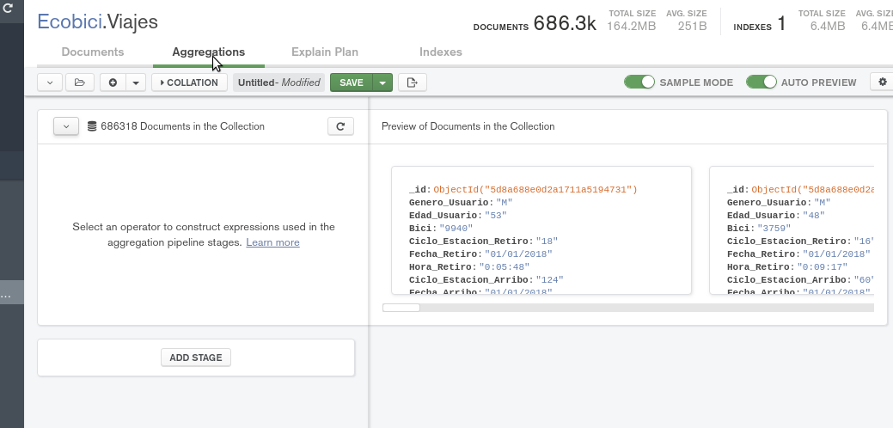
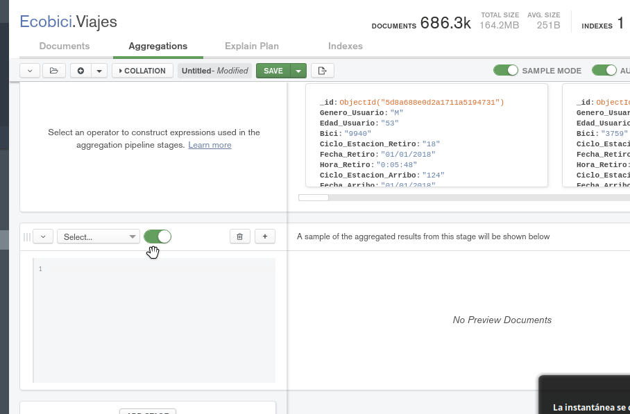
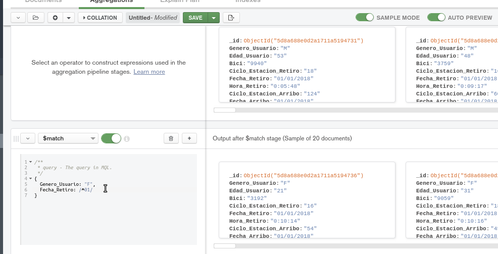
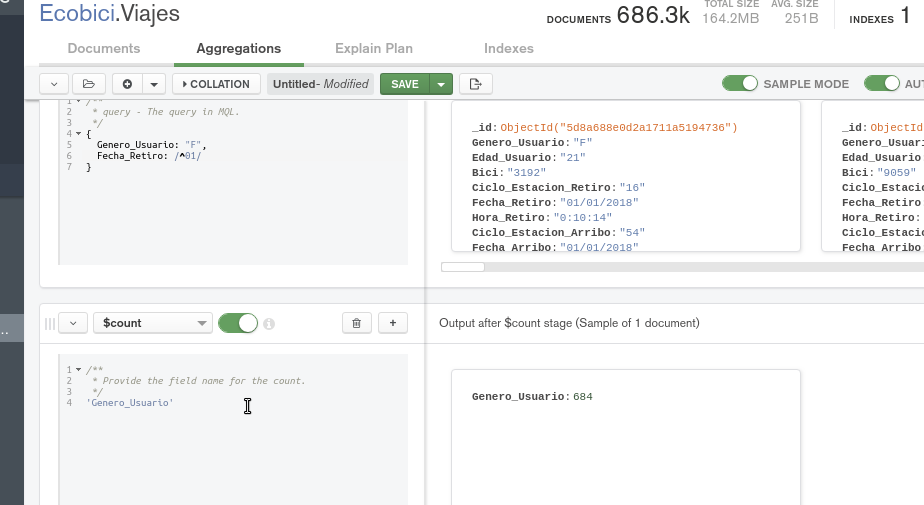
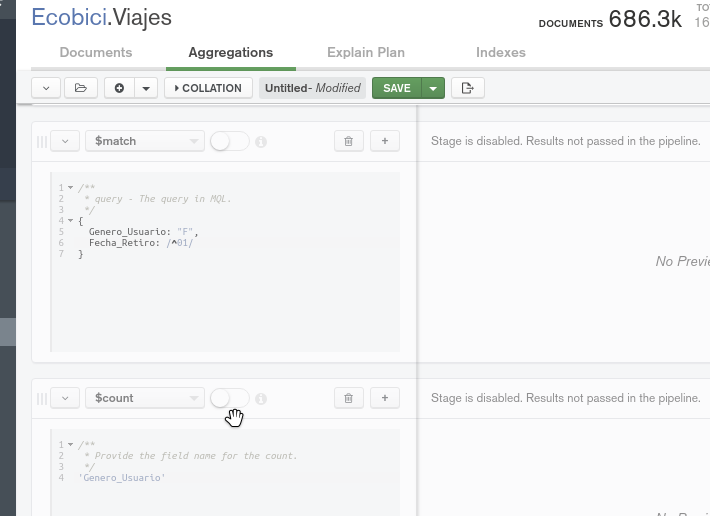
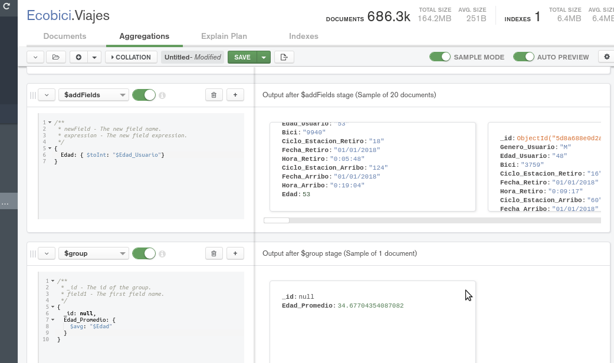
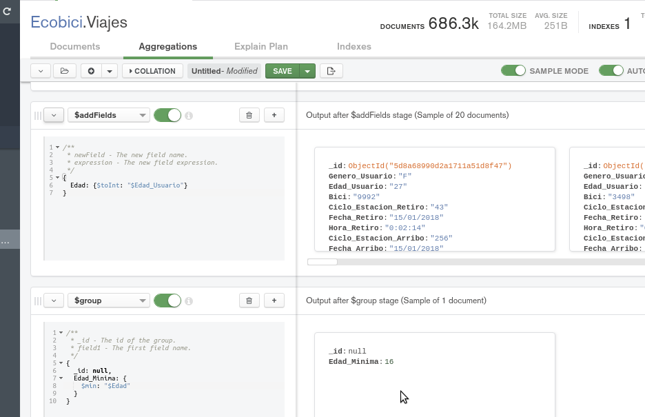

[`Fundamentos de Base de Datos`](../../Readme.md) > [`Sesión 06`](../Readme.md) > Ejemplo-03
## Calculando datos con MongoDB

### OBJETIVO
- Que el alumno conozca como realizar consultas con resultados calculados

### REQUISITOS
1. Repositorio actualizado
1. Usar la carpeta de trabajo `Sesion-06/Ejemplo-03`
1. Contar con la base de datos __Ecobici__ y las colecciones __Clima__ y __Viajes__

### DESARROLLO
1. Para poder realizar calculos en MongoDB como contar, sumar, etc, se requiere hacer uso de las funciones de agregación y en este caso se usarán para obtener la cantidad de ciclistas mujeres que usaron la ecobici el 1o de enero del 2018

   Lo primero es dar click en la pestaña con nombre __Agregations__ y se mostrará algo similar a lo siguiente:
   

   Después se da click en el botón __ADD STAGE__ para agrega una fase
   

   Esta primera fase será la encargada de seleccionar los documentos que se desean contar, así que se hace uso de la agregación __$match__ con la siguiente expresión:
   ```json
   {
     Genero_Usuario: "F",
     Fecha_Retiro: /^01/
   }
   ```

   El resultado es como el siguiente:
   

   Se agrega otra fase presionando el botón __ADD STAGE__ y ahora se hace uso de la agregación __$count__ con la siguiente expresión:
   ```json
   'Genero_Usuario'
   ```
   Obteniendo el siguiente resultado:
   

1. De la misma forma se hace uso de agregaciones para obtener el promedio de edad de los ciclistas. En este caso la operación se aplica sobre todo el conjunto, pero, el campo de __Edad_Usuario__ es de tipo cadena, así que para poder calcular el promedio primero hay que convertirlo a entero.

   Primero de apagan o borran las etapas creadas creadas anteriormente para que no interfieran con el nuevo cálculo.
   

   Se agrega la etapa que hace la conversión de la edad creando un nuevo campo llamado __Edad__ para todos los documentos, haciendo uso de la agregación __$addFields__:
   ```json
   {
     Edad: {$toInt: "$Edad_Usuario"}
   }
   ```

   Finalmente see agrega la etapa para calcular el promedio haciendo uso de la agregación __$group__ y el operador __$avg__
   ```json
   {
     _id: null,
     Edad_Promedio: {
       $avg: "$Edad"
     }
   }
   ```
   Obteniendo el siguiente resultado:
   

1. Hacer uso de etapas para obtener la edad del viajero más joven el 15 de enero del 2018.

   La primera etapa es para reducir el número de documentos, así que se hace uso de __$match__ para obtener todos los viajes realizados el 15 de enero:
   ```json
   {
     Fecha_Retiro: /^15/
   }
   ```
   La forma más simple es haciendo uso de expresiones regulares.

   Después se agrega la etapa para convertir el campo __Edad_Usuario__ de tipo cadena creando el nuevo campo __Edad__ de tipo entero haciendo uso de __$addFields__:
   ```json
   {
     Edad: {$toInt: "$Edad_Usuario"}
   }
   ```

   Y al final se agrega la etapa para obtener la edad mínima haciendo uso de __$group__ y __$min__:
   ```json
   {
     _id: null,
     Edad_Minima: {
       $min: "$Edad"
     }
   }
   ```

   El resultado es similar al siguiente:
   
