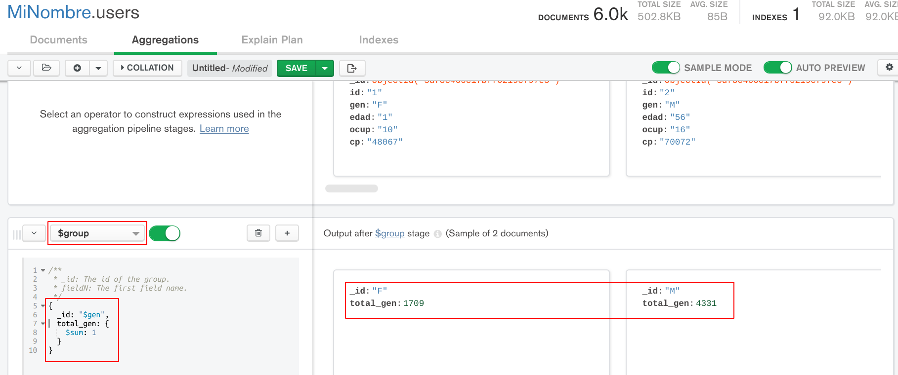
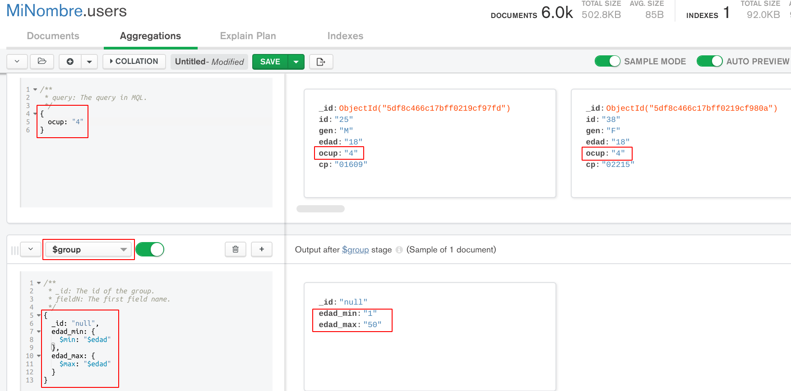

[`Fundamentos de Base de Datos`](../../Readme.md) > [`Sesión 06`](../Readme.md) > Ejemplo-03
## Calculando datos haciendo uso de funciones en MongoDB

### OBJETIVO
- Hacer uso de funciones para hacer cálculos aritméticos en MongoDB
- Hacer uso de la agregación `$group`
- Obtener resultados calculados y agrupados

### REQUISITOS
1. Repositorio actualizado
1. Contar con la base de datos __MiNombre__ y las colecciones __users__, __movies__ y __ratings__
1. MongoDB Compass conectado al Servidor con los datos proporcionados para tu grupo

### DESARROLLO
1. En la `Sesion-04` se obtuvieron la cantidad de usuarios por cada género disponible usando SQL, ahora se obtendrá usando MongoDB.

   Para obtener el resultado se hace uso de la agregación `$group` que funciona muy similar a la instrucción SQL `GROUP BY`, el código usado es el siguiente:
   ```
   {
     _id: "$gen",
     total_gen: {
       $sum: 1
     }
   }
   ```
   Con el campo `_id` se indica el campo con el que se realizará la agrupación, `total_gen` es un nuevo campo que será usado para hacer la cuenta de cuantos documentos hay por cada opción en el campo `gen` y para hacer la cuenta se hace uso de un acumulador (concepto de MongoDB) o función `$sum`, que realiza la suma de uno para cada documento en la colección.

   El resultado obtenido es el siguiente:
   

   Sólo se usó una sola etapa obteniendo el resultado de 1709 mujeres y 4331 hombres.

1. Ahora también se quiere conocer la cantidad de usuarios que hay por cada una de las ocupaciones y ordenarlos de mayor a menor.

   Para esta solución se hace uso de dos etapas, la primera con la función `$group` y la segunda con `sort`

   El código para `$group` es el siguiente:
   ```
   {
     _id: "$ocup",
     total_ocup: {
       $sum: 1
     }
   }
   ```
   La agrupación en este caso se realiza en base al campo `ocup` y el total de cada ocupación quedará en el nuevo campo calculado `total_ocup`.

   El código para `sort` es el siguiente:
   ```
   {
     total_ocup: -1
   }
   ```
   Recordar que el ordenamiento descendente es con `-1`.

   El resultado se muestra a continuación:
   

   La ocupación con valor `4`, que corresponde a `estudiantes universitarios` (según el archivo README) es la que más participantes ha tenido, que es el valor que ya se había obtenido anteriormente.

1. En el punto anterior, la ocupación `4` fue la de mayor participación, ahora se desea obtener el rango de edades de los usuarios que participaron, para ello se necesita la edad máxima y mínima de los usuarios.

   Para la solución se hará uso de una agregación para filtrar todos los documentos que tienen ocupación `4`, se hace uso de `match`:
   ```
   {
     ocup: "4"
   }
   ```

   Después se usa otra agregación con `$group` y los acumuladores o funciones `$min` y `$max` para encontrar la edad mínima y máxima. El código queda como sigue:
   ```
   {
     _id: "null",
     edad_min: {
       $min: "$edad"
     },
     edad_max: {
       $max: "$edad"
     }
   }
   ```
   El campo `_id` se usa con el valor `null` para indicar que el agrupamiento es sobre todos los documentos, después se crean los nuevos campos `edad_min` y `edad_max` para calcular la edad mínima y máxima respectivamente.

   El resultado obtenido es:
   

   Con lo que se obtiene que el rango de edades van desde menores de edad (1) hasta los 55 años para usuarios cuya ocupación es `estudiantes universitarios` (4).

__Misión cumplida__
