[`Fundamentos de Base de Datos`](../../Readme.md) > [`Sesión 06`](../Readme.md) > Ejemplo-04
## Realizando consultas vinculando dos o más colecciones en MongoDB

### OBJETIVO
- Crear consultas que relaciones a dos o más tablas en MongoDB
- Responder a preguntas que relacionen más de una fuente de información

### REQUISITOS
1. Repositorio actualizado
1. Contar con la base de datos __MiNombre__ y las colecciones __users__, __movies__ y __ratings__
1. MongoDB Compass conectado al Servidor con los datos proporcionados para tu grupo

### DESARROLLO
1. En SQL se realizó la petición de imprimir la lista de todas las películas cuyo género sea horror, misterio o suspenso, ahora se quiere conocer también el número de valoraciones que se han realizado para cada una de ellas.

   Se inicia creando una agregación con `match` para obtener las películas con el género indicado en la colección `movies`:
   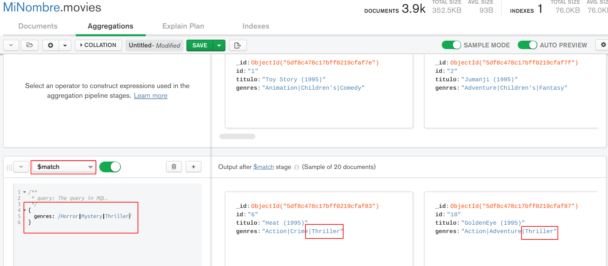

   Ahora se relaciona con la tabla `ratings` haciendo uso de la agregación `lookup`, que permite obtener los documentos de la colección `ratings` que coincidan para cada documento de `movies` en base a un campo seleccionado. Las opciones para `lookup` son:
   ```
   {
     from: 'ratings', // Colección a relacionar
     localField: 'id', // Campo para relación en movies
     foreignField: 'movieid' // Campo en ratings
     as: 'ratings'  // Nombre del nuevo campo en movies
   }
   ```
   El resultado que se obtiene es:
   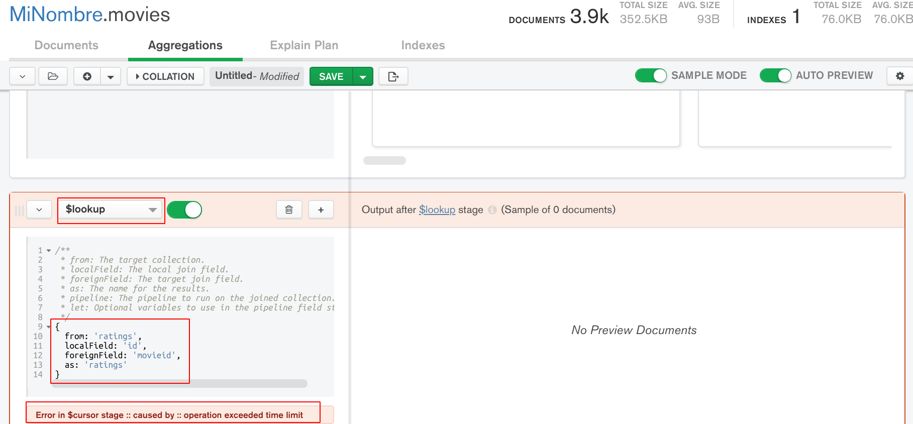

   Opsss! En lugar de un resultado se obtiene un error indicando `operation exceeded time limit`, por lo que nuestra operación está excediendo el tiempo que `MongoDB Compass` tiene definido para un conjunto de etapas, asì que hay dos opciones, o se aumenta el tiempo o se busca la manera de hacer la consulta más rápida.

   Nos vamos por la segunda opción ya que aún falta agregar más etapas y se necesitará más tiempo, así que primero se observa que la agregación `lookup` hace uso del campo `movies.id` donde la colección sólo tiene 3883 documentos Y las consultas son relativamente rápidas, pero para el caso del campo `ratings.movieid` la colección tiene 1000209 documentos, entonces para optimizar las consultas se agregará un __indice__ al campo `movieid`.

   Abrir una nueva consulta presionando el botón `+` a la derecha de `MiNombre.movies Agregations`, lo que abre nuevamente una consulta a la colección `movies`, así que desde el panel izquierdo se cambia a la colección `ratings` obteniendo lo siguiente:
   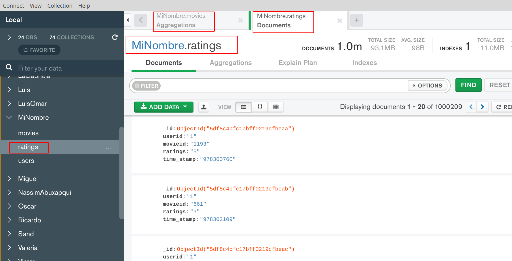

   Entonces dar click en la opción `Indexes`
   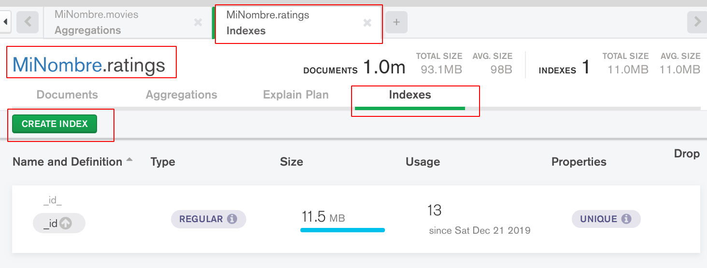

   Dar click en `CREATE INDEX` que abre el siguiente diálogo:
   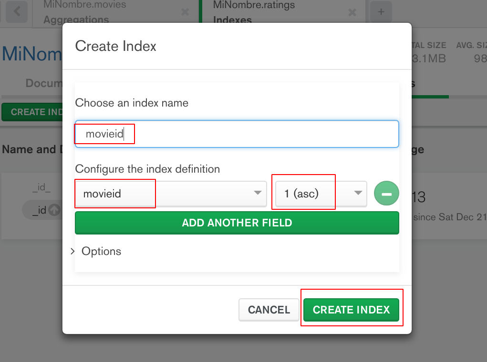

   El índice es una facultad de las bases de datos que permite ordenar y sobre todo acelerar las consultas, en ese caso a una Colección en base a un campo o grupo de campos.

   Para crear un índice se asigna un nombre `movieid`, selecciona el campo `movieid` y se indica el tipo de ordenamiento que tendrá el índice, en este caso ascendente y luego click en `CREATE INDEX` obteniendo la lista de índices creados.
   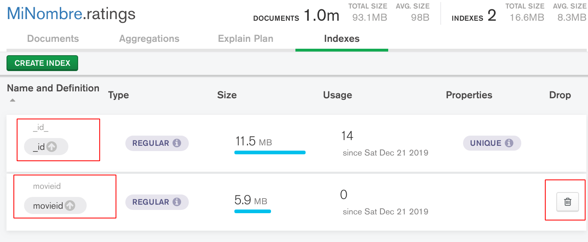

   Se regresa a la pestaña de `Minombre.movies Aggregations`, se desactiva y activa la etapa de `lookup` obteniendo el resultado en un tiempo de 1 a 2 seg.
   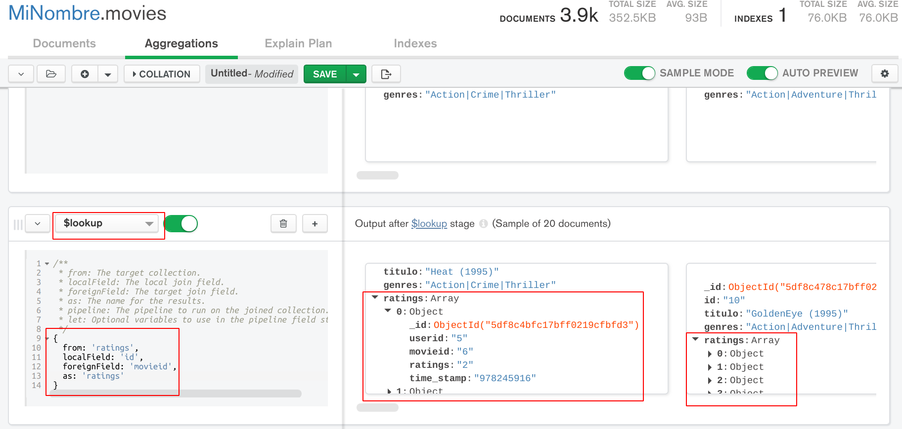

   En el resultado se observa que por cada películas se agrego un nuevo campo llamado `ratings` que es un arreglo que tiene un elemento por cada valoración (rating) realizada a la película, así que lo que sigue es contar cuantos elementos tiene ese arreglo.

   Se usa otra agregación con `$addfields` y la función `$size` para obtener el tamaño del arreglo y asignarlo en un nuevo campo llamado `num_ratings`, el resultado se muestra a continuación:
   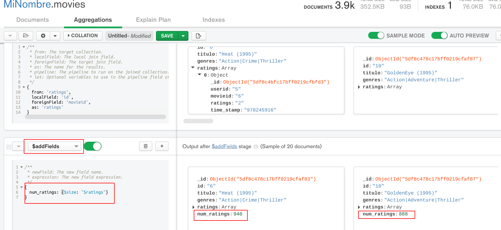

   Para seleccionar sólo los campos deseados, se aplica una agregación `$project`:
   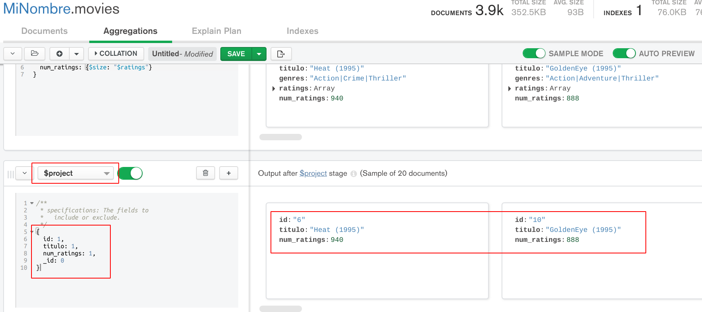

   Finalmente se aplica una etapa con la agregación `sort` para ordenar los documentos en base al campo calculado `num_ratings` en ascendente obteniendo:
   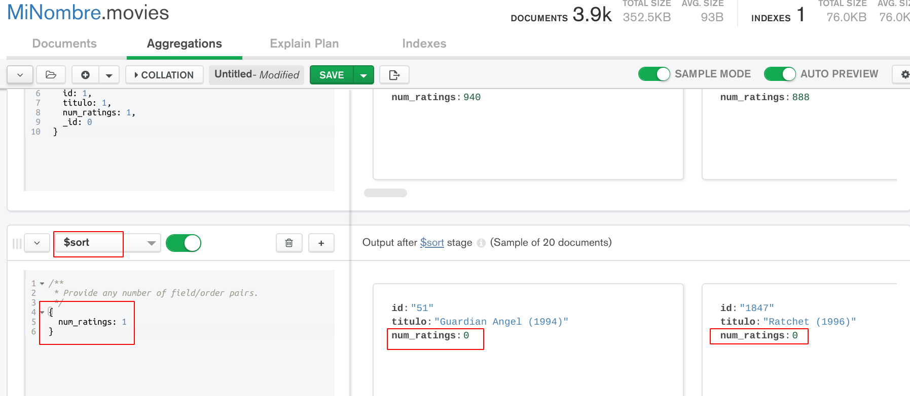

   Una de las conclusiones al ver estos resultados, es que hay películas a las que no se le hizo ninguna valoración y también se podrían conocer las 10 películas con mayor cantidad de valoraciones (ratings) ¿cierto?

1. Entonces ahora ya se pueden realizar consultas para conocer la cantidad de usuarios femenino y masculino que realizaron una valoración de valor 4.

   Para la solución es necesaria la colección __ratings__ para encontrar todas las valoraciones con valor 4 y luego hay que usar la colección __users__ para determinar cuantas de estas valoraciones fueron realizadas por cada género.

   Primero se usa una etapa con la agregación `match` en la colección __ratings__ para dejár sólo los documentos que tienen `ratings=4`
   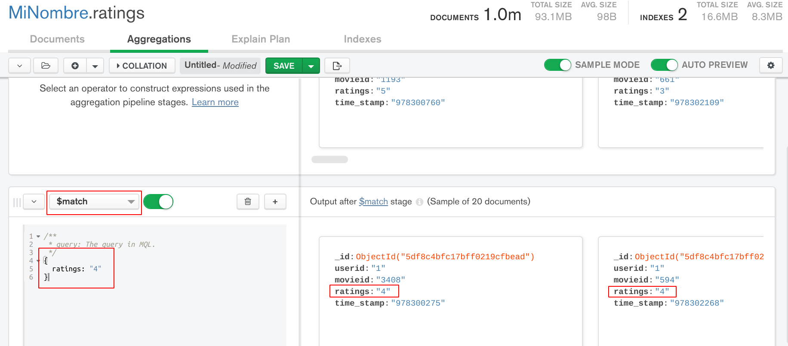

   Después la relación con la colección __users__ se realiza con el uso de la agregación `lookup`, quedando las opciones de `lookup` como sigue:
   ```
   {
     from: 'users',
     localField: 'userid',
     foreignField: 'id',
     as: 'user'
   }
   ```
   El resultado es el siguiente:
   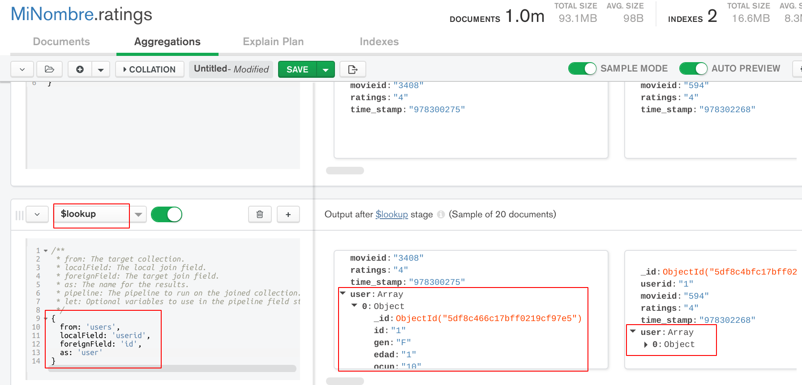
   Con esto se obtiene por cada documento en la colección de __ratings__ toda la información del usuario en el nuevo campo `user`, así que ahora se cuenta también con el género por medio de `user.gen`.

   Para obtener nuestro resultado, hay que contar cuantos documentos son de cada género usando la agregación `group` con las siguientes opciones:
   ```
   {
     _id: '$user.gen',
     num_gen: {
       $sum: 1
     }
   }
   ```
   Obteniendo el resultado siguiente:
   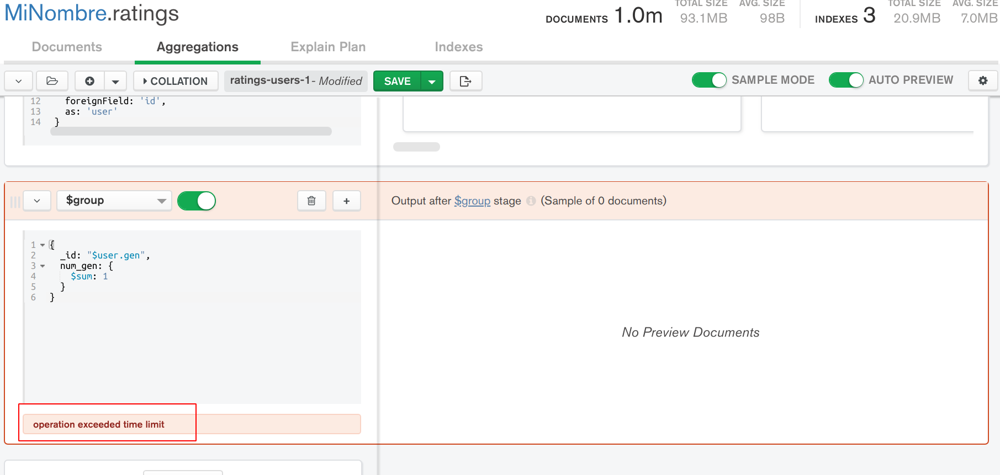
   En este caso la consulta no logró realizarse apareciendo el mensaje de que la operación ha excedido el límite de tiempo, esto es porque __MongoDB Compass__ tiene configurado un tiempo de 5000 milisegundos para ejecutar todas las etapas.

   Para eliminar este error, hay que cambiar este valor a 60 000 milisegundos, esto se hace dando click en el icono del engrane que está a la derecha de la barra de botones, lo que hará que aparezcan varias opciones que se pueden cambiar, entre ellas __Max Time__, también será necesario ajustar el valor de __Limit__ a 1 000 210, ya que limita la cantidad de documentos de entrada para cada etapa. Al terminar da click en el botón __APPLY__.
   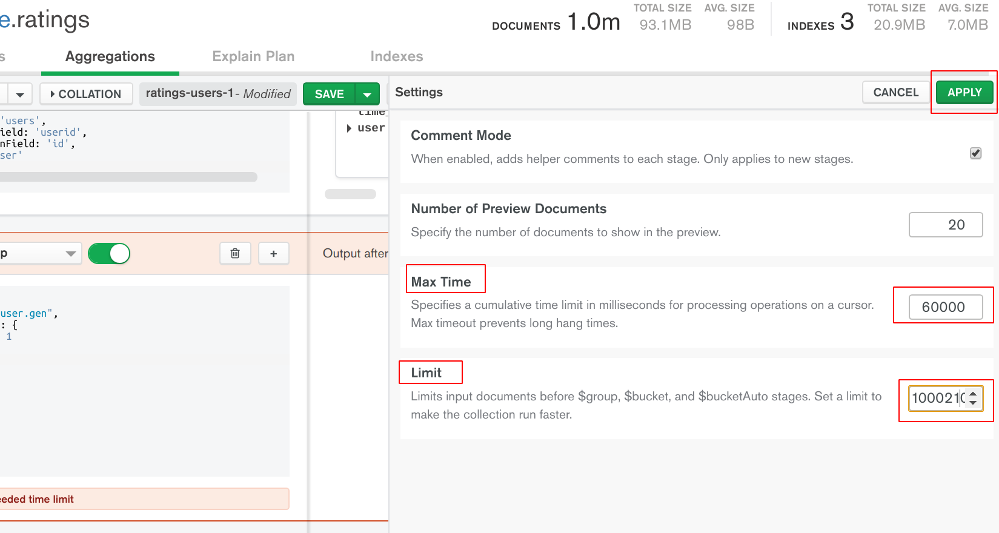

   En automático, __MongoDB Compass__ intentará ejecutar la consulta de la agregación `group` generando el siguiente resultado:
   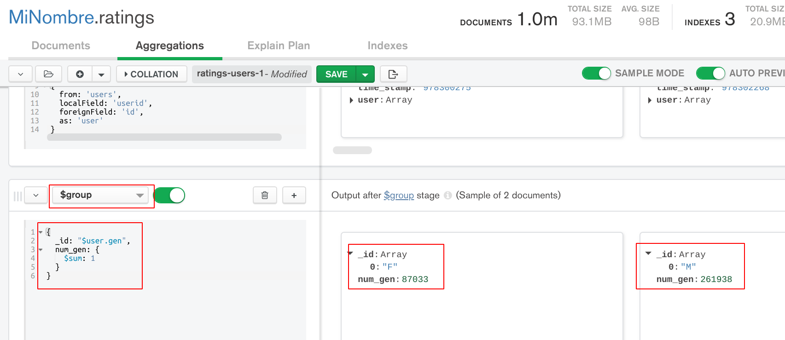

   En este resultado se observa que el género femenino tuvo menor participación en el caso de las valoraciones de valor 4.

__Misión cumplida__
