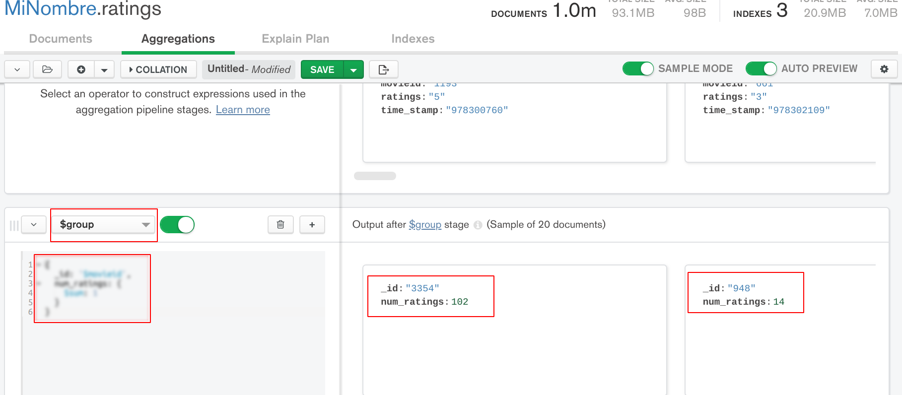
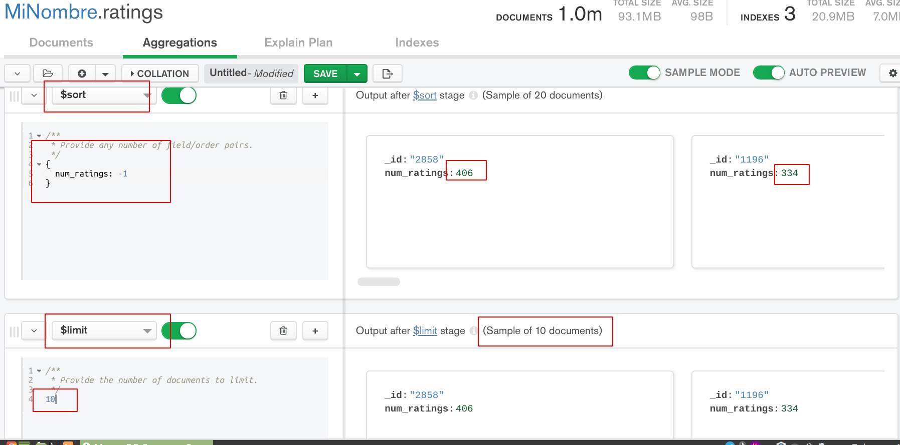
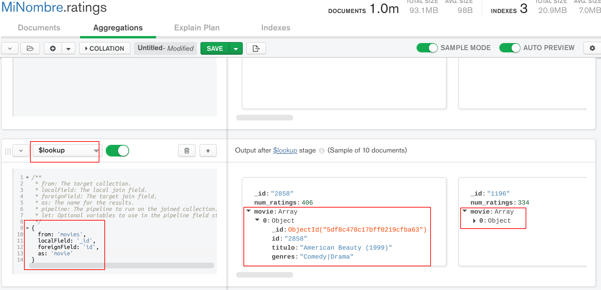
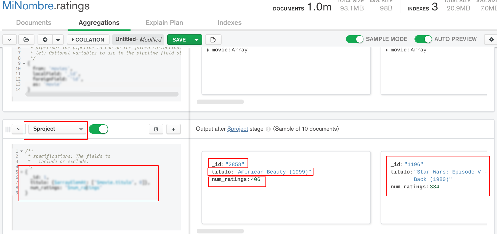
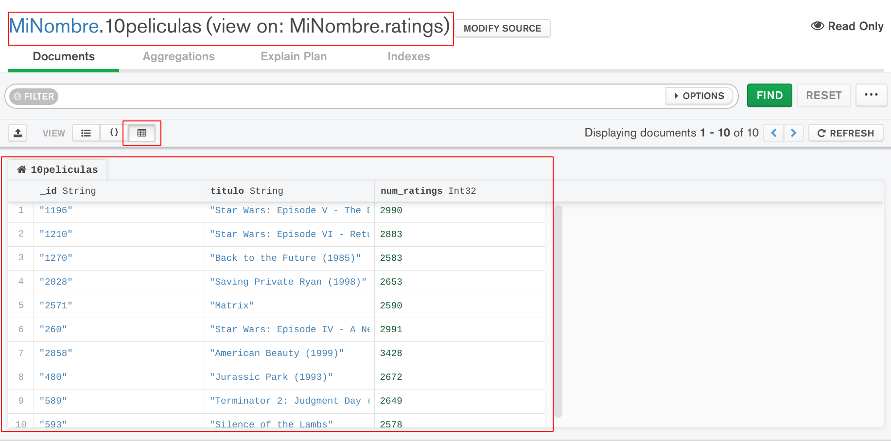
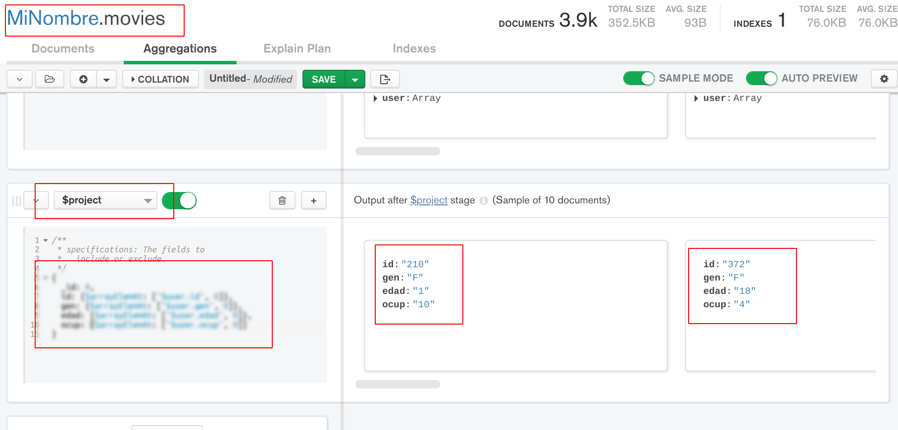

[`Fundamentos de Base de Datos`](../../Readme.md) > [`Sesión 06`](../Readme.md) > Proyecto
## Realizando consultas vinculando dos o más colecciones en MongoDB

### OBJETIVO
- Crear consultas que relaciones a dos o más tablas en MongoDB
- Responder a preguntas que relacionen más de una fuente de información
- Aplicar los conceptos de filtrado, orden, agrupación y funciones de MongoDB

### REQUISITOS
1. Repositorio actualizado
1. Contar con la base de datos __MiNombre__ y las colecciones __users__, __movies__ y __ratings__
1. MongoDB Compass conectado al Servidor con los datos proporcionados para tu grupo

### DESARROLLO
1. Imprime la lista de la 10 películas con mayor cantidad de valoraciones.

   Lo primero es usar la colección __ratings__ para agrupar y contar el número de valoraciones por cada película usando una agregación `group` con:
   ```
   {
     _id: "$movieid",
     num_ratings: {
       $sum: 1
     }
   }
   ```
   Obteniendo el resultado:
   
   Así que ahora se sabe cuantas valoraciones ha tenido cada película.

   Entonces ahora se ordena en forma descendente y se obtienen sólo los primeros 10 documentos usando las agregaciones `sort` y `limit` obteniendo el resultado:
   

   Con el resultado anterior se tiene la lista de las 10 películas con más número de valoraciones, ahora sólo falta agregar el título haciendo uso de la agregación `lookup` con los siguiente parámetros:
   ```
   {
     from: "movies",
     localField: "_id",
     foreignField: "id",
     as: "movie"
   }
   ```
   El resultado obtenido es:
   

   Ahora ya se tienen todos los datos de cada una de las 10 películas, pero si sólo se requiere del `_id`, `titulo` y `num_ratings` se puede usar otra etapa con `project` con la siguiente configuración:
   ```
   {
     _id: 1,
     titulo: {$arrayElemAt: ["$movie.titulo", 0]},
     num_ratings: "$num_ratings"
   }
   ```
   El resultado es el siguiente:
   

   Haciendo uso de `project` se han definido los campos a mostrar y en el orden deseado.

   Finalmente se puede guardar toda la agregación como una vista y mostrar los resultados de forma tabular
   

   Pero ¿serán las películas con mejor o peor valoración?

1. Imprime la lista de todos los usuarios con género femenino que dieron una valoración de 5 a la película con título "Deep Blue Sea" e indica cuantos son.

   La solución se puede obtener de varias formas, pero se puede comenzar con la colección __movies__ para encontrar el `id` de la película con título "Deep Blue Sea" usando agregaciones con una etapa `match`:
   ```
   {
     titulo: /Deep Blue Sea/
   }
   ```
   Después se obtiene la lista de todas las valoraciones (ratings) que corresponden a esta película usando otra etapa con `lookup`:
   ```
   {
     from: "ratings",
     localField: "id",
     foreignField: "movieid",
     as: "ratings"
   }
   ```
   El resultado crea el campo `ratings` que es un arreglo con todas las valoraciones realizadas para esta película, pero se desea que crear un documento nuevo por cada elemento en el array, así que se hace uso de una etapa con `unwind` con:
   ```
   {
     path: "$ratings"
   }
   ```
   Así que ahora usa otra etapa con `match` para seleccionar sólo los documentos cuya valoración tiene un valor de 5:
   ```
   {
     "ratings.ratings": "5"
   }
   ```
   Ahora se necesita la información del género que está en la colección __users__, entonces se usa otra etapa con `lookup`:
   ```
   {
     from: "users",
     localField: "ratings.userid",
     foreignField: "id",
     as: "user"
   }
   ```
   Esto no agrega el campo `user` con todos los datos del usuario, así que ahora sólo hay que seleccionar lo que tiene género femenino con otra etapa:
   ```
   {
     "user.gen": "F"
   }
   ```
   Y finalmente para obtener un resultado más ordenado se usa una etapa más con `project` para seleccionar los datos a mostrar:
   ```
   {
     _id: 0,
     id: {$arrayElemAt: ["$user.id", 0]},
     gen: {$arrayElemAt: ["$user.gen", 0]},
     edad: {$arrayElemAt: ["$user.edad", 0]},
     ocup: {$arrayElemAt: ["$user.ocup", 0]},
   }
   ```
   Obteniendo el resultado siguiente:
   

   Con lo que se obtiene la lista de los usuarios solicitada con un total de 10 registros, posiblemente esto sea un poco más complejo que en SQL, pero estamos haciendo consultas a datos estructurados donde es el fuerte de SQL.

__Misión cumplida__
