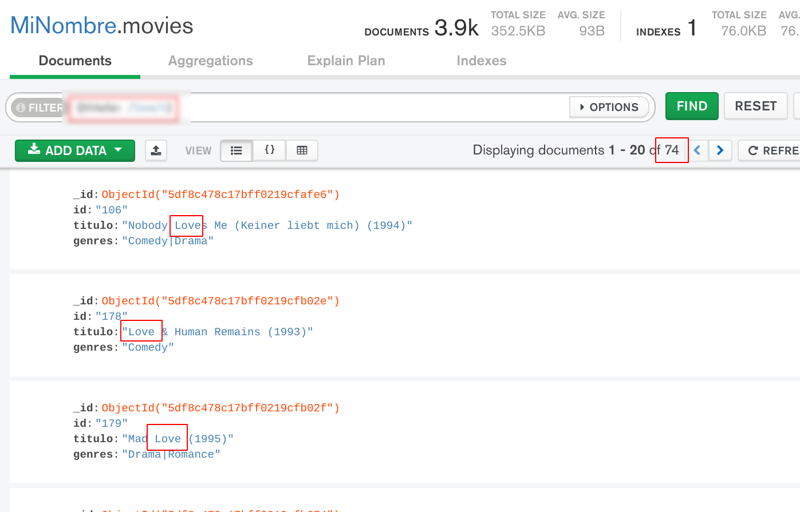
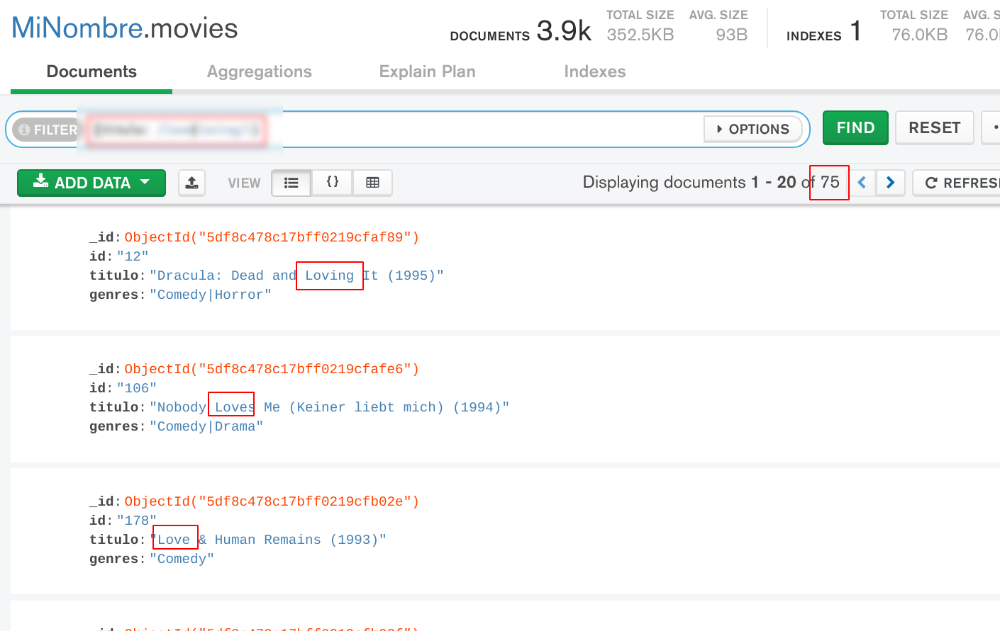
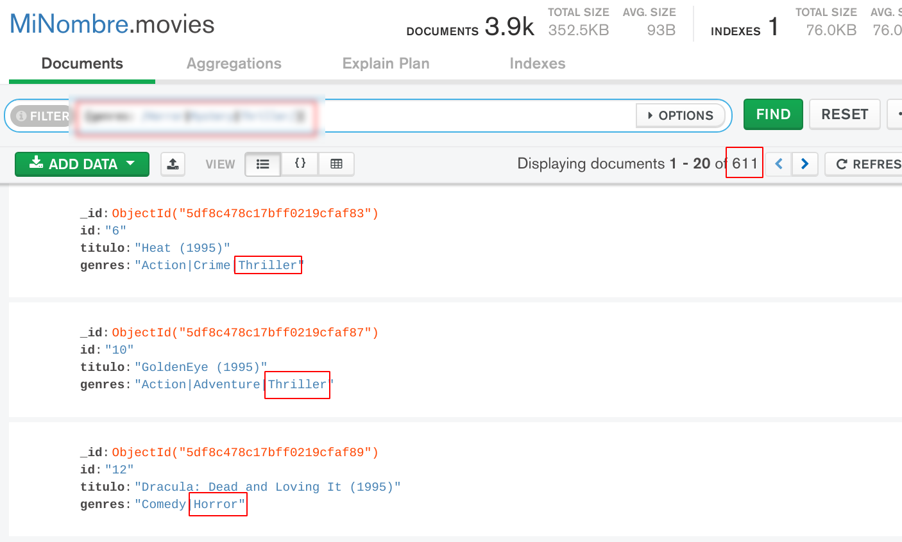
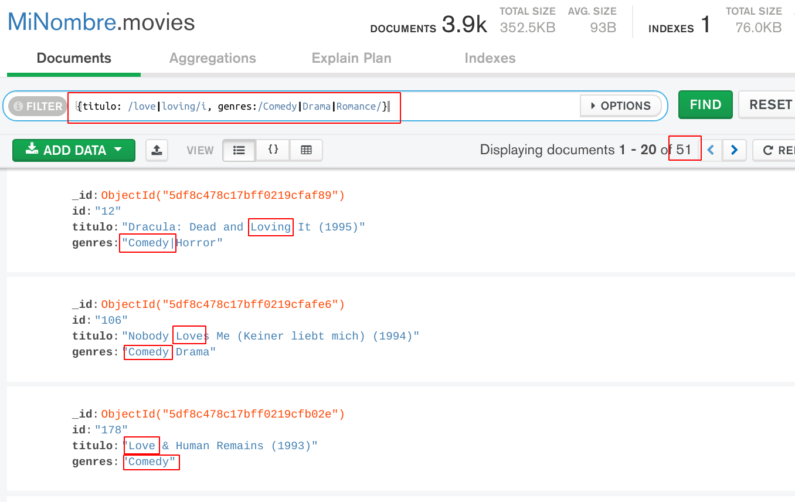

[`Fundamentos de Base de Datos`](../../Readme.md) > [`Sesión 06`](../Readme.md) > Reto-01
## Realizando consultas usando expresiones regulares en MongoDB

### OBJETIVO
- Que el alumno aprenda como usar expresiones regulares en la creación de consultas.
- Que el alumno responda a preguntas donde involucre búsqueda de cadenas de texto.

### REQUISITOS
1. Repositorio actualizado
1. Contar con la base de datos __MiNombre__ y las colecciones __users__, __movies__ y __ratings__

### DESARROLLO
1. Imprimir la lista de películas cuya temática esté relacionada con _amor_ (love) de la colección `movies`.

   La primer aproximación es usar el siguiente filtro:
   ```
   ???
   ```
   El resultado es:
   

   Se obtienen 74 documentos que incluyen el texto `love` en su título, sin embargo para encontrar todas las películas con la temática de amor, habría que incluir el texto `loving` (amando), entonces el filtro quedará como:
   ```
   ???
   ```
   El resultado obtenido es el siguiente:
   

   __Nota:__ Recuerda que puedes consultar la documentación sobre expresiones regulares en:
   - https://www.w3schools.com/js/js_regexp.asp

   En el resultado hay 75 documentos que tienen que ver con el tema de _amor_.

1. Imprime la lista de todas las películas cuyo género sea horror, misterio o suspenso e indica cuantas son.

   Una forma de solucionarlo es hacer uso de expresiones regulares junto con el operador `or` quedando el filtro como el siguiente:
   ```
   ???
   ```
   El resultado obtenido es:
   

   Se observar que las películas pertenecen a los géneros solicitados y en total son 611.

1. Finalmente se desea imprimir la lista de todas la películas cuyo género sea comedia, drama o romance y cuya temática sea de amor.

   La solución es una combinación de los dos casos anteriores, así que tendría que ocupar un operador `AND` en algún momento:
   ```
   ???
   ```
   Dando el resultado:
   

   En el resultado se puede comprobar como los documentos incluyen el texto `love` o `loving` y en el género en este el texto de `Comedy`

   El resultado da un total de 51 películas que cumplen con los criterios.

__Misión cumplida__
