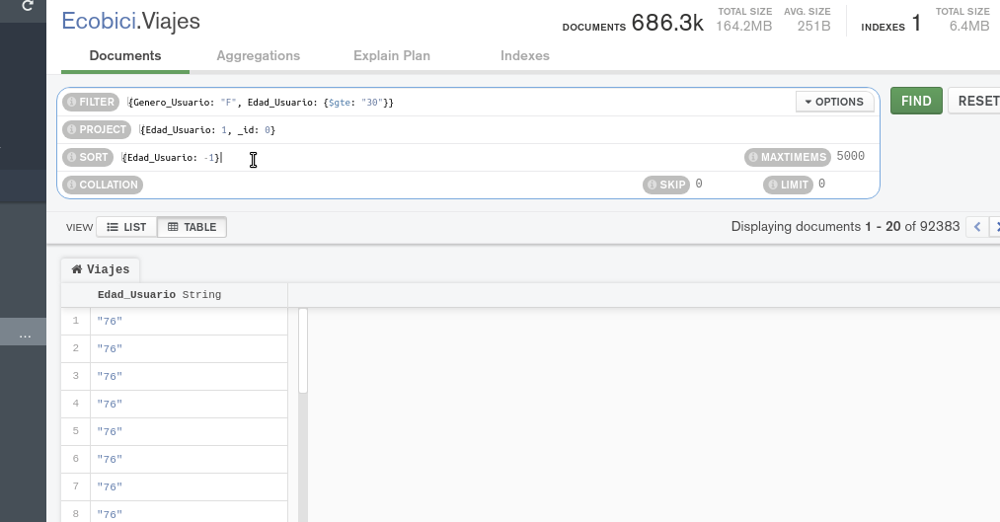
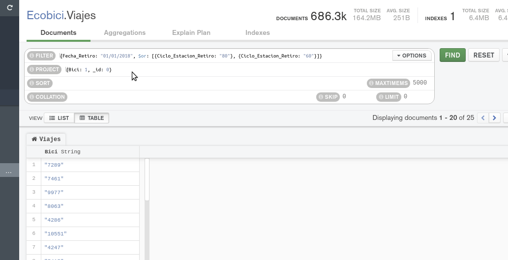

[`Fundamentos de Base de Datos`](../../Readme.md) > [`Sesión 06`](../Readme.md) > Reto-01
## Consultando nuestra base de datos MongoDB

### OBJETIVO
- Que el alumno realice consultas básicas en MongoDB

### REQUISITOS
1. Repositorio actualizado
1. Usar la carpeta de trabajo `Sesion-06/Reto-01`
1. Contar con la base de datos __Ecobici__ y las colecciones __Clima__ y __Viajes__

### DESARROLLO
1. Obtener la lista de todas las edades de los usuarios en la colección __Viajes__ realizados por una mujer y con edad mayor a 30 años en orden descendente.

   En SQL el equivalente es `SELECT Edad_Usuario FROM Viajes WHERE Genero_Usuario="F" AND Edad_Usuario > 30 ORDER BY Edad_Usuario DESC`.

   Para realizar la misma consulta en __Compass__ se hará uso de __Filter__
   ```json
   ???
   ```
   La coma hace la función de operador AND permitiendo aplicar dos operaciones

   de __Proyect__
   ```json
   ???
   ```
   Recuerda que 1 indica que el campo presente y 0 no presente.

   y de __Sort__
   ```json
   ???
   ```
   Recuerda que 1 indica ascendente y -1 indica descendente

   Obteniendo un resultado similar a:
   

1. Imprime la lista de todas las Bicis que fueron retiradas el `01/01/2018` de las ciclo estaciones 60 u 80.

   Nuevamente la solución requiere de hacer uso de __Filter__ con el operador __OR__ y __Proyect__

   El __Filter__ queda de la siguiente manera:
   ```json
   ???
   ```

   El __Project__ queda así:
   ```json
   ???
   ```

   Y el resultado sería como el siguiente:
   
