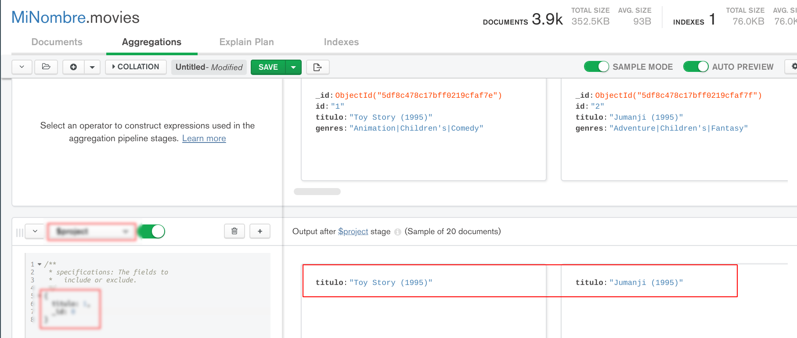
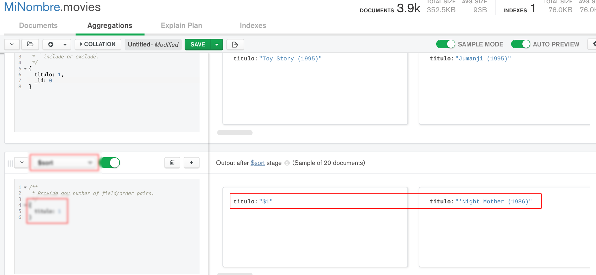
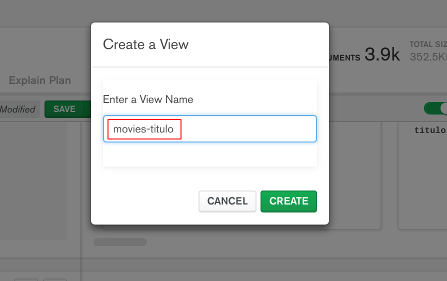
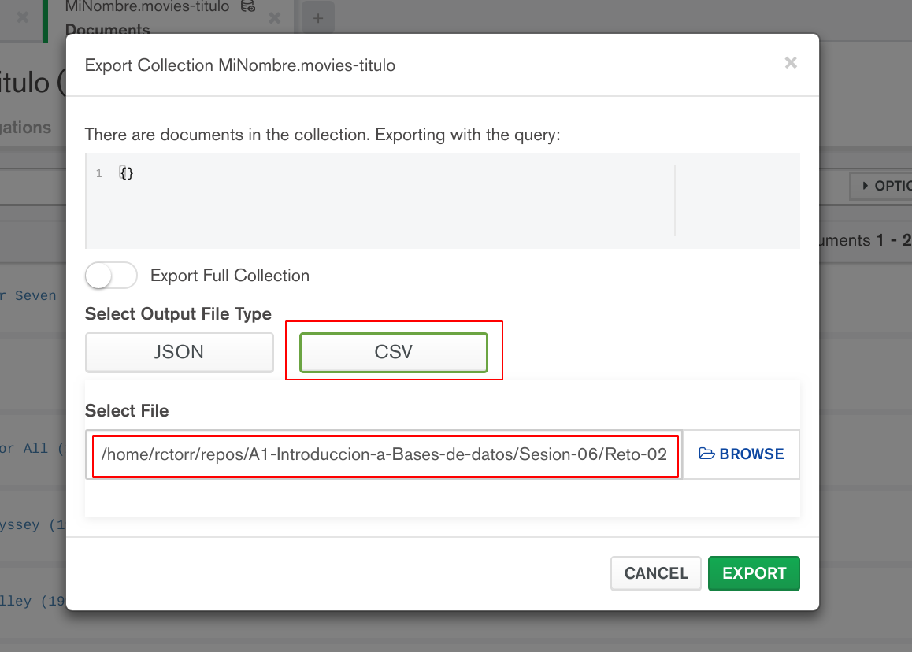

[`Fundamentos de Base de Datos`](../../Readme.md) > [`Sesión 06`](../Readme.md) > Reto-02
## Ordenando y guardando resultados en MongoDB

### OBJETIVO
- Obtener resultados ordenados en base a un campo
- Guardar los resultados de las consultas

### REQUISITOS
1. Repositorio actualizado
1. Contar con la base de datos __MiNombre__ y las colecciones __users__, __movies__ y __ratings__
1. MongoDB Compass conectado al Servidor con los datos proporcionados para tu grupo

### DESARROLLO
1. Haz que tu carpeta de trabajo sea `Introduccion-a-Bases-de-Datos/Sesion-06/Reto-02/`
   ```console
   $ cd Introduccion-a-Bases-de-Datos/Sesion-04/Reto-02
   Reto-02 $
   ```

1. Imprime y guarda sólo el nombre de todas las películas de la colección `movies` en orden alfabético en formato CSV en el archivo `movies-titulo.csv`.

   Nuevamente se hace uso de las Agregaciones y la primer etapa es para elegir los campos a mostrar con `$project` quedando el código de la siguiente forma:
   ```
   {
     titulo: 1,
     _id: 0
   }
   ```
   Obteniendo el siguiente resultado:
   

   Se observa como ya todos los documentos sólo tienen el campo `titulo`.

   Ahora se procede a ordenarlos usando otra etapa con `$sort`, donde se ordena en base al campo `titulo` en ascendente:
   ```
   {
     titulo: 1
   }
   ```
   Dando el resultado:
   

   Se observa que los títulos están ya ordenados en orden alfabético.

   Así que ahora se guarda como una nueva colección usando el botón `SAVE`:
   

   Y se exporta con la opción del menú `Collections > Export Collection` con el nombre `movies-titulo.csv` y formato CSV:
   

   Abre una terminal (Git Bash en Windows) y cambiarse a la carpeta `Sesion-06/Reto-02/` y ejecuta el comando siguiente para validar el resultado:
   ```console
   Reto-02 $ less movies-titulo.csv
   titulo
   $1
   'Night Mother (1986)
   'Til There Was You (1997)
   'burbs
   ...And Justice for All (1979)
   1-900 (1994)
   10 Things I Hate About You (1999)
   101 Dalmatians (1961)
   101 Dalmatians (1996)
   12 Angry Men (1957)
   13th Warrior
   187 (1997)
   2 Days in the Valley (1996)
   20
   20 Dates (1998)
   200 Cigarettes (1999)
   2001: A Space Odyssey (1968)
   2010 (1984)
   24 7: Twenty Four Seven (1997)
   24-hour Woman (1998)
   28 Days (2000)
   3 Ninjas: High Noon On Mega Mountain (1998)
   movies-titulo.csv
   ```

__Misión cumplida__
