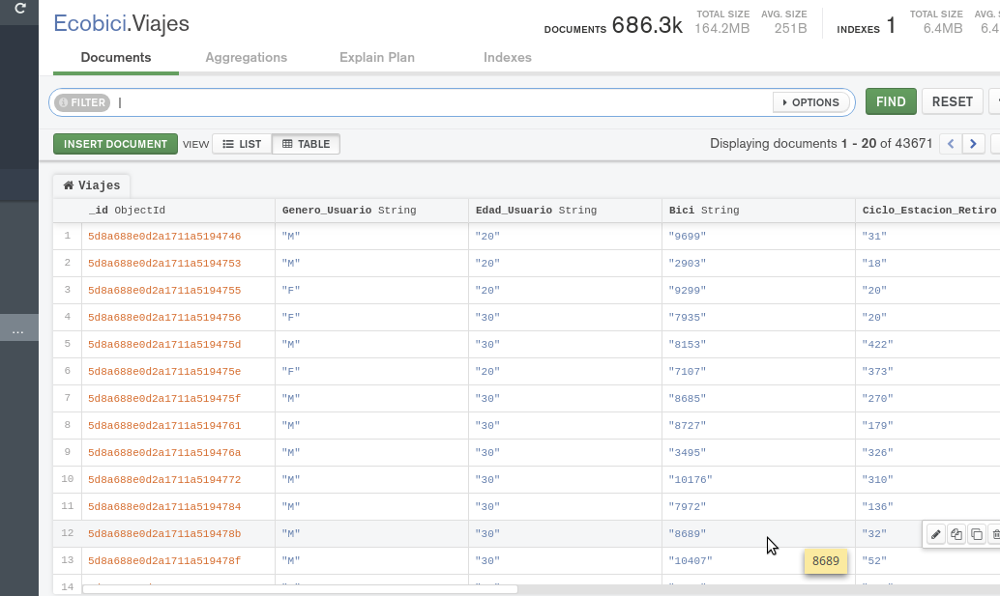
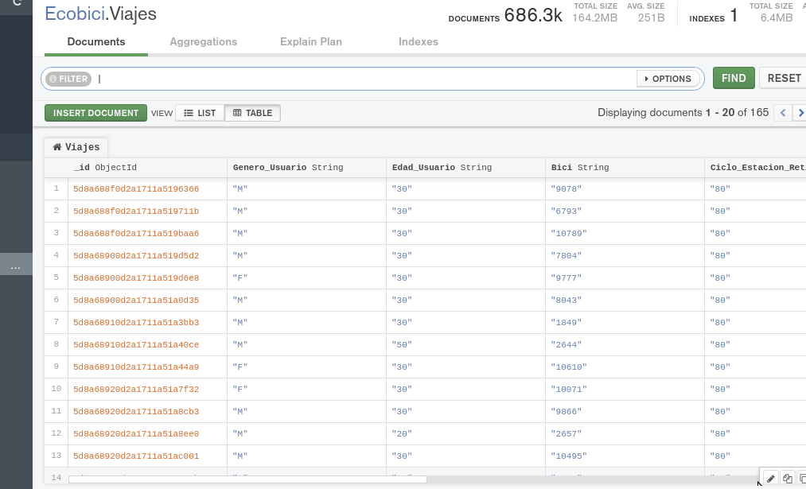
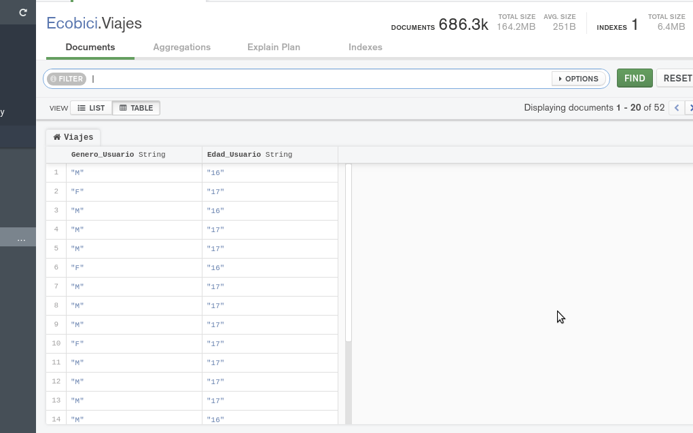

[`Fundamentos de Base de Datos`](../../Readme.md) > [`Sesión 06`](../Readme.md) > Reto-02
## Filtrado avanzado en MongoDB

### OBJETIVO
- Que el alumno haga uso de operadores en las consultas

### REQUISITOS
1. Repositorio actualizado
1. Usar la carpeta de trabajo `Sesion-06/Reto-02`
1. Contar con la base de datos __Ecobici__ y las colecciones __Clima__ y __Viajes__

### DESARROLLO
1. Obtener la lista de todos los viajes donde el usuario tenga edades de 60, 30 y 20.

   El filtro a aplicar sería el siguiente:
   ```json
   ???
   ```
   El resultado será:
   

1. Mostrar todos los viajes donde los usuarios tengan edades de 50, 30 y 20, pero además que hayan tomado bici de las ciclo estaciones 80, 100 y 190.

   El filtro a aplicar en __Compass__ sería:
   ```json
   ???
   ```
   El resultado debe ser similar al siguiente:
   

1. Obtener la lista de el genero y edad de todos los usuarios cuyos viajes iniciaron a las 7 hrs con cualquier fracción de minutos y que además son menores de edad.

   El filtro usado es el siguiente:
   ```json
   ???
   ```

   y la proyección es:
   ```json
   ???
   ```

   El resultado debe ser similar al siguiente:
   
