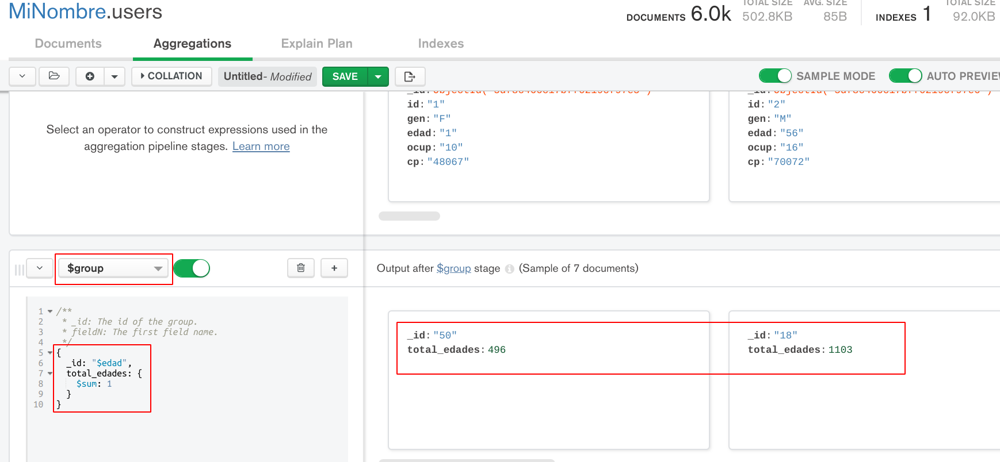
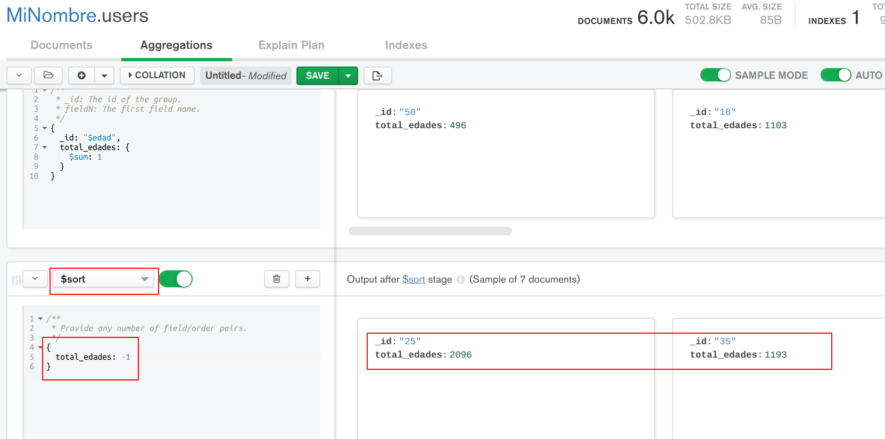
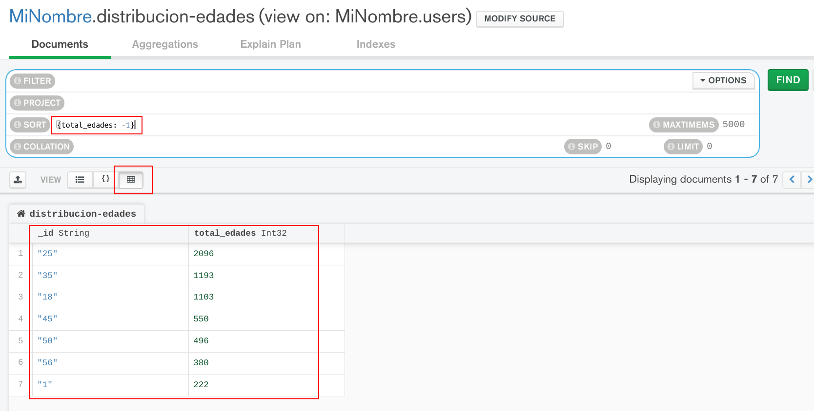

[`Fundamentos de Base de Datos`](../../Readme.md) > [`Sesión 06`](../Readme.md) > Reto-03
## Calculando datos haciendo uso de funciones en MongoDB

### OBJETIVO
- Hacer uso de funciones para hacer cálculos aritméticos en MongoDB
- Hacer uso de la agregación `$group`
- Obtener resultados calculados y agrupados

### REQUISITOS
1. Repositorio actualizado
1. Contar con la base de datos __MiNombre__ y las colecciones __users__, __movies__ y __ratings__
1. MongoDB Compass conectado al Servidor con los datos proporcionados para tu grupo

### DESARROLLO
1. Se desea conocer la cantidad de usuarios que hay por cada rango de edades y ordenarlos de mayor a menor y comentar resultados.

   Primero se aplica una agregación con `group` en el campo `edad` para agrupar y contar los documentos en la colección `users`, el código sería el siguiente:
   ```
   {
     _id: "$edad",
     total_edades: {
       $sum: 1
     }
   }
   ```
   El resultado obtenido es:
   

   Después se usa otra agregación con `sort` para ordenar de mayor a menor usando l código:
   ```
   {
     total_edades: -1
   }
   ```
   El resultado obtenido es:
   

   El paso final consiste en guardar el resultado como una nueva colección usando el botón `SAVE` y asigando el nombre `distrucion-edades` obteniendo el siguiente resultado:
   

   El resultado tiene que ser nuevamente ordenado pero usando la barra de `SORT`, también se ha usado la vista en forma de tabla para ver los resultados de forma compacta.

__Misión cumplida__
