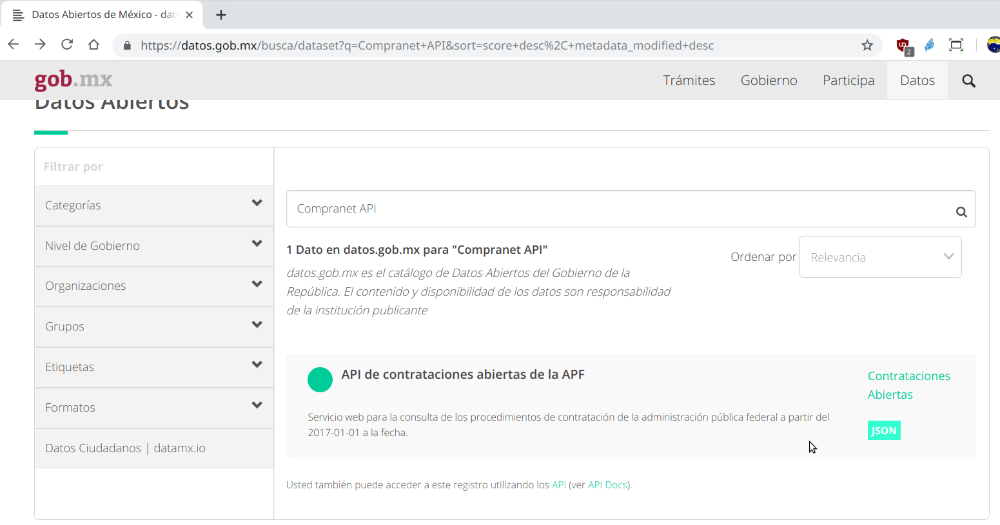
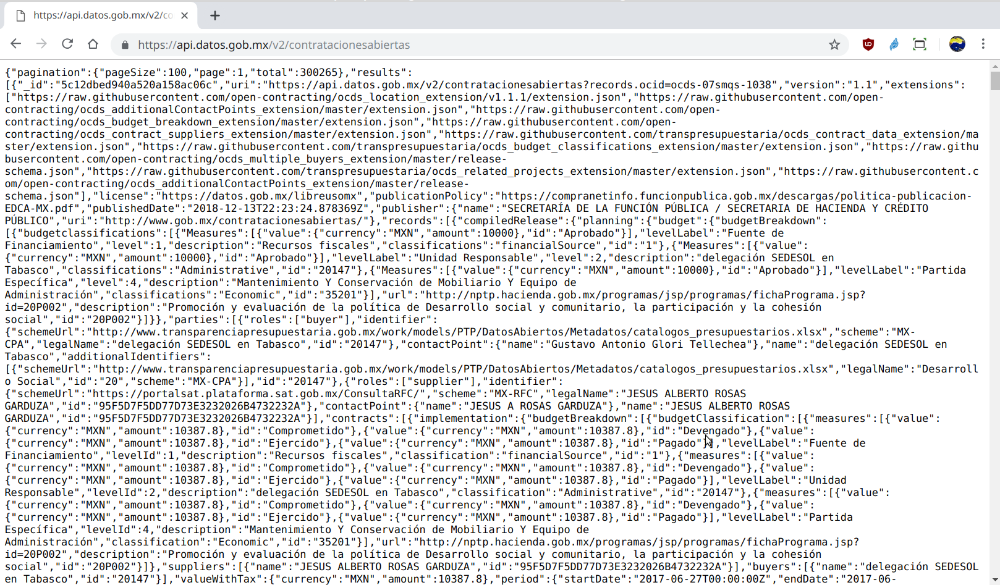

[`Fundamentos de Base de Datos`](../../Readme.md) > [`Sesión 07`](../Readme.md) > Ejemplo-01
## Obteniendo conjuntos de datos vía API

### OBJETIVO
- Que el alumno acceda a conjuntos de datos vía API

### REQUISITOS
1. Repositorio actualizado
1. Usar la carpeta de trabajo `Sesion-07/Ejemplo-01`

### DESARROLLO
1. El primer paso es contar con el acceso vía API a algún conjunto de datos, recuerda que la ventaja de usar una API es que los datos serán en general muy recientes o incluso actualizados en tiempo real y para este ejemplo usaremos el _API de contrataciones abiertas de la Administración Pública Federal_ de México con datos a partir del 2017-01-01 a la fecha.

   Para obtener la url de acceso a la API se hace uso del sitio de __Datos Abiertos__ y en particular de la página que nos permite buscar conjuntos de datos y se puede acceder en la url https://datos.gob.mx/busca/dataset

1. Encontrar el conjunto de datos a utilizar por medio de una búsqueda con los términos __Compranet API__ obteniendo el siguiente resultado:
   

   Dar click sobre el nombre de la API y en la nueva página dar click sobre el botón __Descargar__, lo que mostrará el conjunto de datos en formato json:
   

   Como verás el resultado está en formato JSON y además en este caso la API es abierta, si deseas consultar u obtener datos de API cerradas o simplemente contar con un programa que visualice el JSON en un formato más amigable puedes intentar usar [Postman](https://www.getpostman.com)

1. El siguiente paso es descargar el conjunto de datos, así que damos click con el botón derecho y luego click en __Guardar como__ y con el nombre `compranet-contrataciones.json`.
   

   En este punto tenemos ya un conjunto de datos actualizados obtenidos desde una API.
