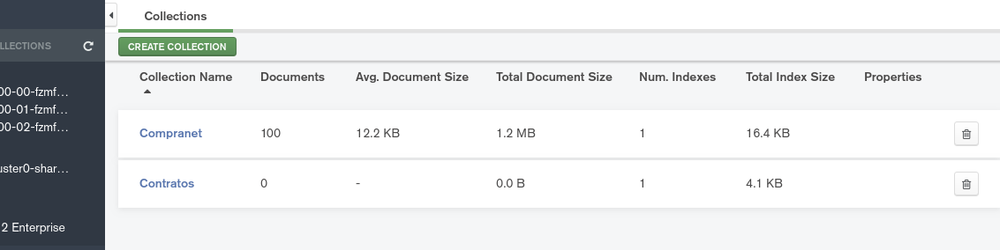
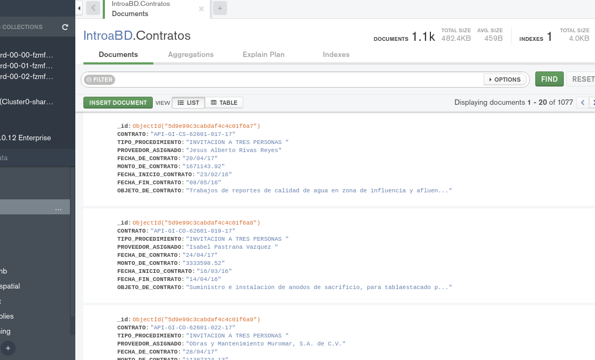

[`Fundamentos de Base de Datos`](../../Readme.md) > [`Sesión 07`](../Readme.md) > Reto-04
## Creación de la base de datos e importación de datos

### OBJETIVO
- Que el alumno prepare el conjunto de datos para ser importado
- Que el alumno importe un conjunto de datos

### REQUISITOS
1. Repositorio actualizado
1. Usar la carpeta de trabajo `Sesion-07/Reto-04`
1. MongoDB Compass Instalado
1. Conexión a Cluster de MongoDB
1. Base de datos `IntroaBD` creada

### DESARROLLO
1. Importar el conjunto de datos de Contratos de Obra de Veracruz obtenido desde el API en el Reto-01.

   Crear la colección __Contratos__

   

   Ahora se procede a importar los datos del archivo `json/contratos-obra-veracruz.json` desde la opción del menú `Collection > Import Data`, donde se elecciona el archivo y se dá click en el botón __IMPORT__

   Se observa que al importar se marca un mensaje de error, así que ajusta el archivo para que pueda ser importado.

   1. Eliminar la parte inicial del archivo
   1. Separar documentos por nueva línea
   1. Eliminar en la parte final del archivo los simbolos sobrantes.

   Importar el archivo nuevamente con __MongoDB Compass__, el resultado debe ser similar al siguiente:

   
