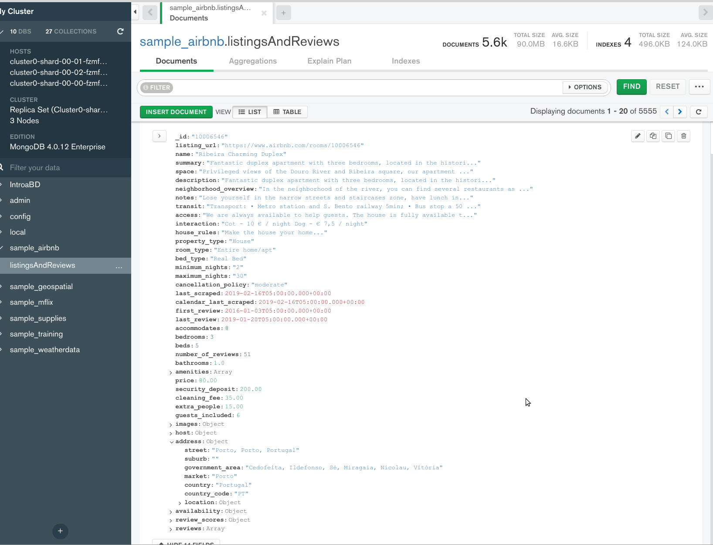
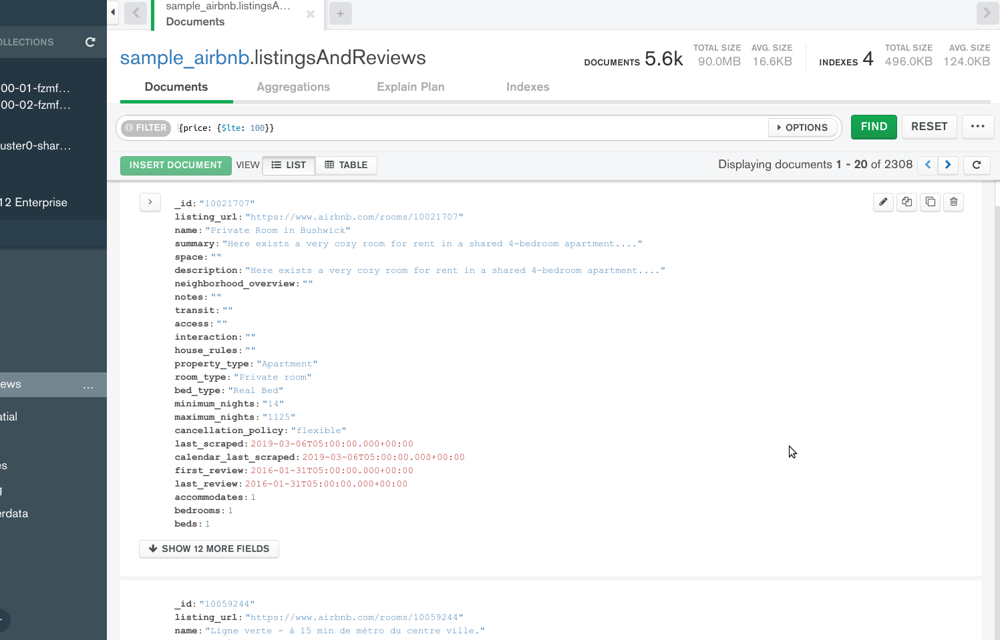
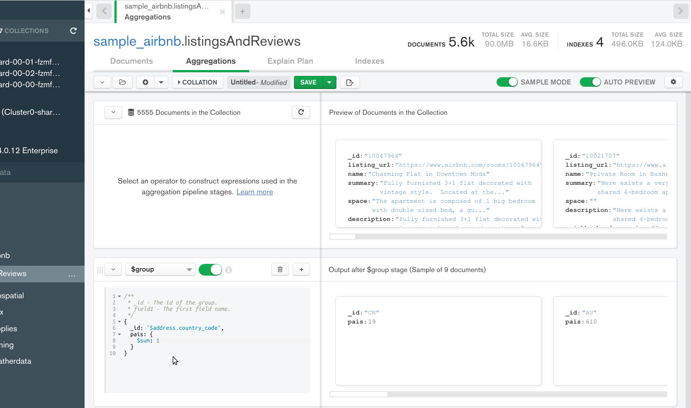
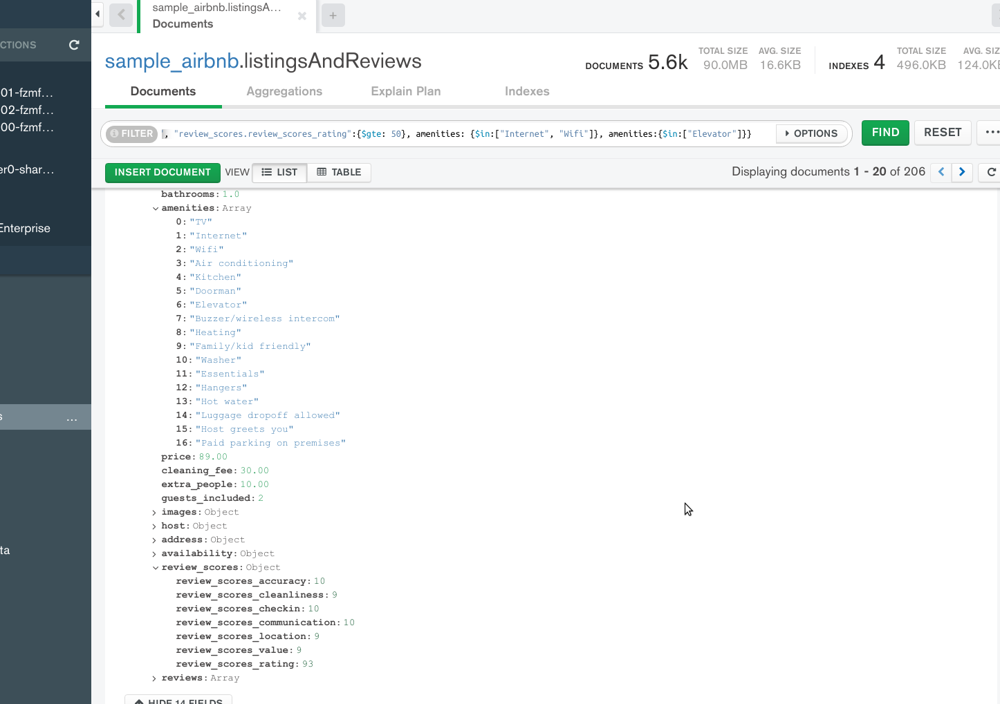

[`Fundamentos de Base de Datos`](../../Readme.md) > [`Sesión 08`](../Readme.md) > Ejemplo-01
## Realizando consultas a base de datos no relacionales en la nube

### OBJETIVO
- Que el alumno aprenda como realizar consultas básicas en MongoDB Atlas

### REQUISITOS
1. Repositorio actualizado
1. Usar la carpeta de trabajo `Sesion-08/Ejemplo-01`
1. Contar con Compass instalado y conectado a la base de datos de muestra __sample_airbnb__, esta base de datos se puede construir a partir de los datos abiertos que porporciona __AirBnB__, pero en este caso, ya ha sido preparado y cargado en nuestra base datos gracias a MongoDB Atlas.

### DESARROLLO
Antes de iniciar a realizar consultas es importante conocer como está estructurado el conjunto de datos, en este caso al ser MongoDB interesa saber cuales son las colecciones y la estructura de los documentos.

Al seleccionar la base de datos __sample_airbnb__ en __MongoDB Compass__, se observa que la única colección es `listingsAndReviews`.

Ahora se selecciona la colección y se observa la estructura de un documento (aunque podría ser que algunos documentos tengan campos diferentes, es espera que la mayoría sean homogéneos)


En este ejemplo se puede observar como hay campos de tipos de datos simples, como enteros, decimales o cadenas, pero también hay campos que son a su vez objetos o arreglos y es ésta una de las principales diferencias entre bases de datos __No SQL__ ya que al poder incluir en una sola colección toda la información relacionada, no es necesario contar con colecciones o tablas adicionales como es el caso de las bases de datos __SQL__.

Así que a continuación se realizarán algunas consultas considerando los campos de tipo objetos o array.

1. Listar todos las publicaciones cuyo costo es inferior a 100.00.

    En __Compass__ haciendo uso de la barra de filtrado se escribe el filtro:
    ```json
    {price: {$lte:100}}
    ```

    El resultado es el siguiente:
    
    Como verás, usando __MongoDB Compass__ con una conexión a un Cluster en MongoDB Atlas la forma de realizar las consultas es exactamente identico a como se realizó con un Servidor local, sólo que hay que contar con una conexión a Internet aceptable y en caso de requerir más potencia en la nube se puede hacer crecer el Cluster tanto como nuestros bolsillos lo permitan.

1. Obtener la lista de todos los países y su código de país, además de cuantas publicaciones hay por cada uno.

   Para esta consulta se hará uso del campo `address` y su atributo `country_code`, por lo que esta consulta se reduce en agrupar todos los documentos y luego contar cuantos hay de cada uno, por lo que se hace uso de una agregación de grupo:
   ```json
   {
     _id: "$address.country_code",
     pais: {
       $sum: 1
     }
   }
   ```

   Dando el resultado siguiente:
   

1. Entonces ahora podemos obtener la lista de todas las publicaciones con un costo menor a 100, que se encuentren en España, con una valoración de 50 o más puntos, que cuenten con Internet o Wifi y que tegan Elevador.

   Para esto sólo se necesita realizar un filtrado que incluya el acceso a los atributos de un objeto y de un arreglo de la siguiente forma:
   ```json
   {price: {$lte: 100}, "address.country_code": "ES", "review_scores.review_scores_rating":{$gte: 50}, amenities: {$in:["Internet", "Wifi"]}, amenities:{$in:["Elevator"]}}
   ```
   Esta es una consulta compleja, por lo que se sugiere irla construyendo por partes, primero todos los que cumplan el precio, luego el país, entonces la valoración, etc.

   Se debería de obtener 206 documentos como resultado:
   
