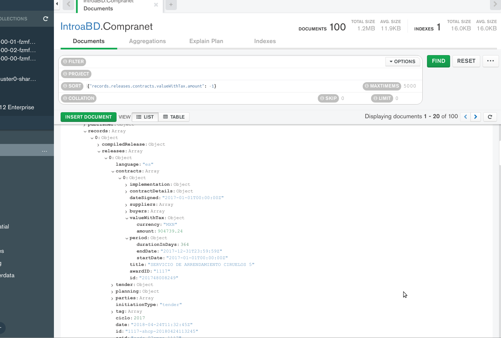

[`Fundamentos de Base de Datos`](../../Readme.md) > [`Sesión 08`](../Readme.md) > Ejemplo-02
## Filtrado avanzado a bases de datos no relacionales en la nube

### OBJETIVO
- Que el alumno aprenda como realizar filtrado en MongoDB Atlas
- Que el alumno fortalezca su habilidad para comprender la estructura de los datos.

### REQUISITOS
1. Repositorio actualizado
1. Usar la carpeta de trabajo `Sesion-08/Ejemplo-02`
1. Contar con Compass instalado y conectado a la base de datos de muestra __IntroaBD__.

### DESARROLLO
Es importante poder comprender la estructura de los datos para poder realizar un análisis, en este caso se hará uso del conjunto de datos de las compras registradas y realizadas en la plataforma Compranet por el Gobierno Federal de México.

1. De la colección __Compranet__ obtener las 10 compras de mayor costo

    Lo que se resuleve ordenando el conjunto de datos por el precio compra en orden descendente y para ello se hace uso de la opción __sort__ de la barra de filtrado usando la siguiente expresión:
    ```json
    {"records.releases.contracts.valueWithTax.amount": -1}
    ```
    Notar que se ha tenido que revisar la estructura de cada documento para encontrar el costo de cada compra y luego simplemente ordenar por ese campo.

    También observar como se realiza la consulta a elementos dentro de un arreglo, ya que no se indica el índice.

    
    Por lo que se obtiene que el producto de mayor costo es de aproximadamente millón y medio de pesos.

1. De la colección __Compranet__ obtener lista de compras cuyo servicio haya durado 180 o más días.

    Nuevamente hay que buscar dentro de los documentos para poder obtener los campos asociados a lo solicitado:
    __filter__:
    ```json
    {"records.releases.contracts.period.durationInDays": {$gte: 180}}
    ```
    Es muy importante escribir los nombres de los atributos tal cual están en el documento, o de lo contrario el resultado estará vacio.

1. De la consulta anterior, obtener la lista sólo con los siguientes campos _id, precio y días.

    En __filter__ se tiene:
    ```json
    {"records.releases.contracts.period.durationInDays": {$gte: 180}}
    ```

    En __project__:
    ```json
    {_id: 1, "records.releases.contracts.valueWithTax.amount":1,  "records.releases.contracts.period.durationInDays": 1}
    ```

    En __sort__:
    ```json
    {"records.releases.contracts.valueWithTax.amount": -1}
    ```

    El resultado es similar a:
    
