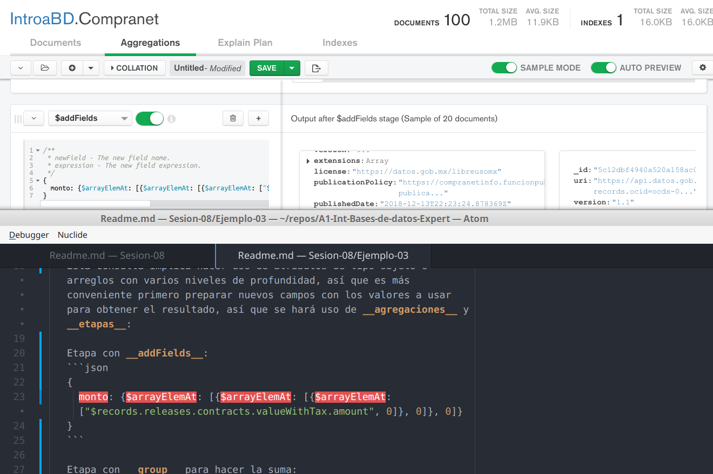
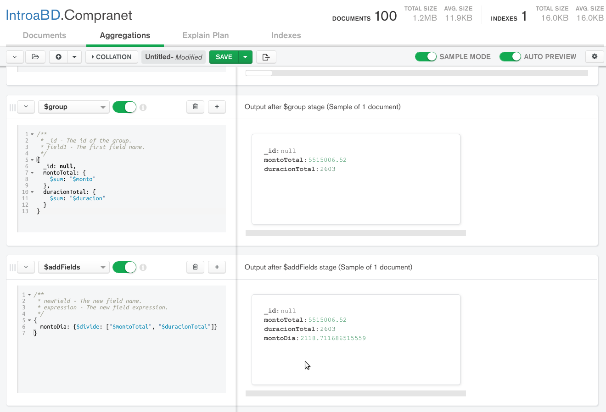

[`Fundamentos de Base de Datos`](../../Readme.md) > [`Sesión 08`](../Readme.md) > Ejemplo-03
## Calculando datos con bases de datos no relacionales en la nube

### OBJETIVO
- Que el alumno realice operaciones en MongoDB Atlas
- Que el alumno fortalezca su habilidad para obtener datos calculados

### REQUISITOS
1. Repositorio actualizado
1. Usar la carpeta de trabajo `Sesion-08/Ejemplo-03`
1. Contar con Compass instalado y conectado a la base de datos propia __IntroaBD__.

### DESARROLLO
Ahora se realizarán consultas usando campos que originalmente no existen en el conjunto de datos, ya sea para simplificar el uso de la información o porque son datos que se obtienen a partir de los ya existentes o porque se necesite reformatear los tipos de datos dejando nuestro conjunto de datos más accesible para realizar análisis.

1. De la colección __Compranet__ obtener el total gastado en compras por el Gobierno Federal:

   Esta consulta implica hacer uso de atributos de tipo objeto o arreglos con varios niveles de profundidad, así que es más conveniente primero preparar nuevos campos con los valores a usar para obtener el resultado, así que se hará uso de __agregaciones__ y __etapas__:

   Etapa con __addFields__:
   ```json
   {
     monto: {$arrayElemAt: [{$arrayElemAt: [{$arrayElemAt: ["$records.releases.contracts.valueWithTax.amount", 0]}, 0]}, 0]}
   }   
   ```
   Para acceder al elemento de un arreglo se usa __$arrayElemAt__.

   Etapa con __group__ para hacer la suma:
   ```json
   {
     _id: null,
     montoTotal: {
       $sum: "$monto"
     }
   }
   ```

   El resultado es el siguiente:
   

1. De la colección __Copranet__ obtener el monto promedio por día

   Nuevamente primero a preparar nuevos campos con los valores a usar para obtener el resultado, así que se hará uso de __agregaciones__ y __etapas__:

   Etapa con __addFields__:
   ```json
   {
     monto: {$arrayElemAt: [{$arrayElemAt: [{$arrayElemAt: ["$records.releases.contracts.valueWithTax.amount", 0]}, 0]}, 0]},
     duracion: {$arrayElemAt: [{$arrayElemAt: [{$arrayElemAt: ["$records.releases.contracts.period.durationInDays", 0]}, 0]}, 0]}
   }   
   ```
   Para acceder al elemento de un arreglo se usa __$arrayElemAt__.

   Etapa con __group__ para hacer la suma:
   ```json
   {
     _id: null,
     montoTotal: {
       $sum: "$monto"
     },
     duracionTotal: {
       $sum: "$duracion"
     }
   }
   ```

   Etapa con __addFields__ para obtener el promedio:
   ```json
   {
     montoDia: {$divide: ["$montoTotal", "$duracionTotal"]}
   }   
   ```

   El resultado es el siguiente:
   
