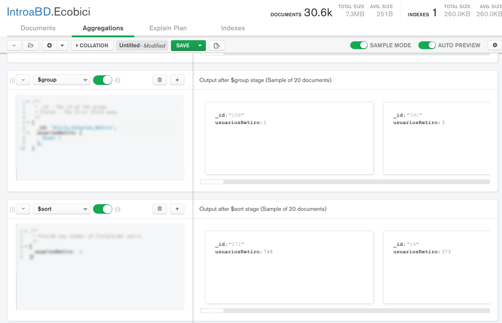
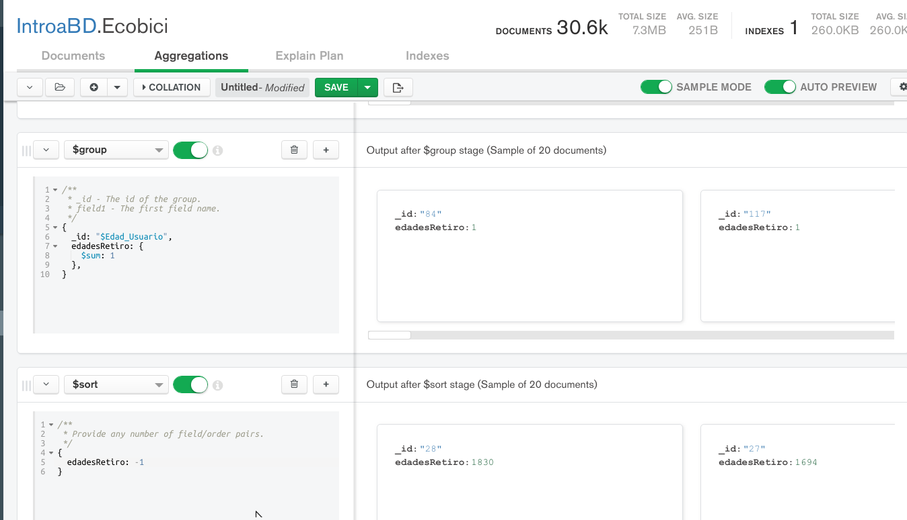
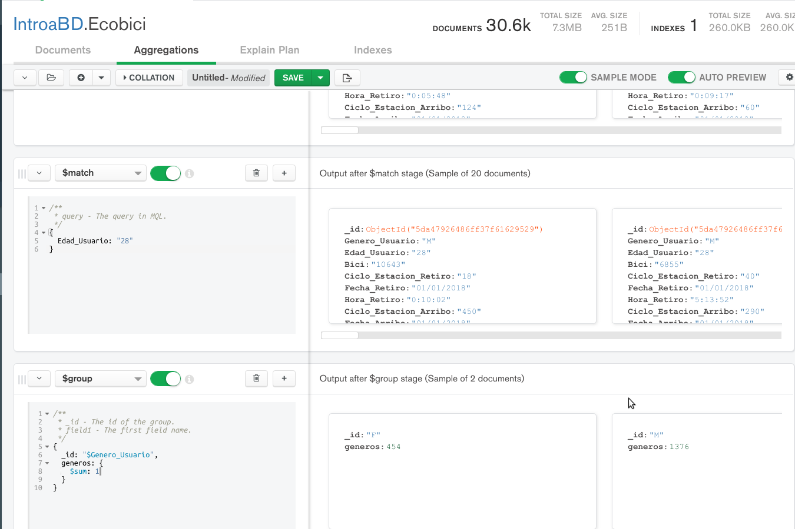

[`Fundamentos de Base de Datos`](../../Readme.md) > [`Sesión 08`](../Readme.md) > Proyecto
## Calculando datos con bases de datos no relacionales en la nube

### OBJETIVO
- Que el alumno realice operaciones en MongoDB Atlas
- Que el alumno fortalezca su habilidad para obtener datos calculados
- Que el alumno mejore su habilidad para comprender la estructura de conjuntos de datos.
- Que el alumno mejore su habilidad para realizar análisis de datos mediante la formulación de preguntas

### REQUISITOS
1. Repositorio actualizado
1. Usar la carpeta de trabajo `Sesion-08/Proyecto`
1. Contar con Compass instalado y conectado a la base de datos propia __IntroaBD__.

### DESARROLLO
Ahora se realizarán consultas para responder algunas preguntas del conjunto de datos de la colleción __Ecobici__.

1. Crea la collección __Ecobici__ en la base de datos __IntroaBD__ en el Cluster de Atlas.

2. Importa los datos generados en el Ejemplo-01 de la Sesion-05

3. Obtener la lista de ciclo estaciones y ordenarlas descendentemente en base a la cantidad de usuarios.

   La solución se obtiene usando agregración con las siguientes etapas:

   __group__:
   ```json
   {
       ???
   }
   ```

   __sort__:
   ```json
   {
     ???
   }
   ```

   Obteniendo el resultado siguiente:
   

1. Obtener La cantidad de retiros realizados por edades de usuario y ordenar las edades de usuarios de mayor a menor en base a la cantidad de retiros.

   La solución se obtiene usando agregración con las siguientes etapas:

   __group__:
   ```json
   {
       ???
   }
   ```

   __sort__:
   ```json
   {
      ???
   }
   ```

   Obteniendo el resultado siguiente:
   

1. En el resultado anterior, indica cuantos son mujeres y cuantos hombres para el grupo de usuarios de 28 años.

   -
   La solución se obtiene usando agregración con las siguientes etapas:

   __match__:
   ```json
   {
     ???
   }
   ```

   __sort__:
   ```json
   {
       ???
   }
   ```

   Obteniendo el resultado siguiente:
   
