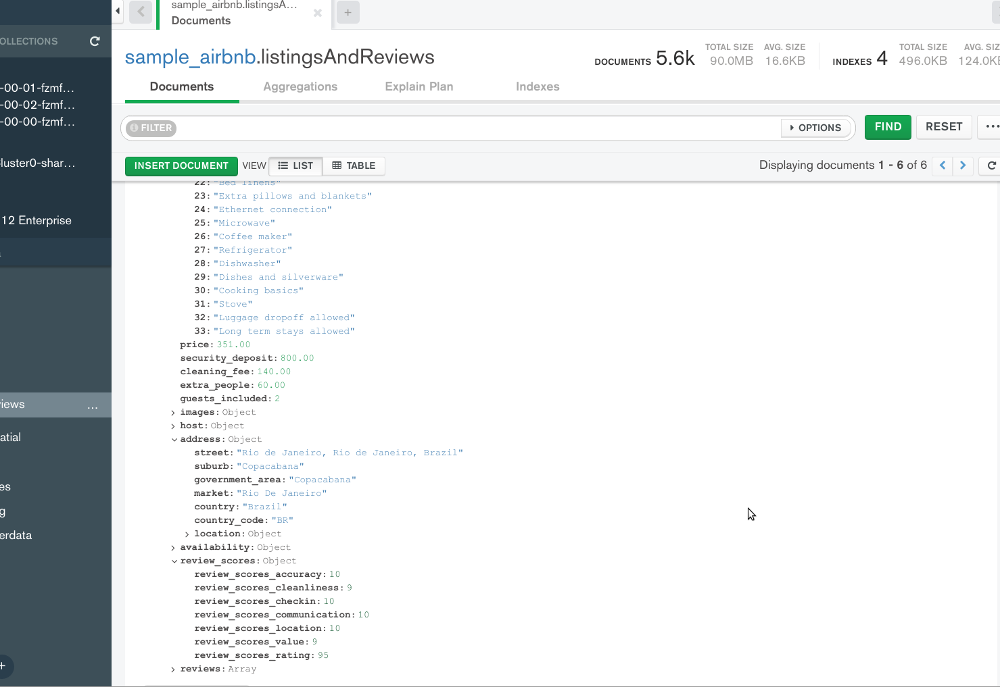
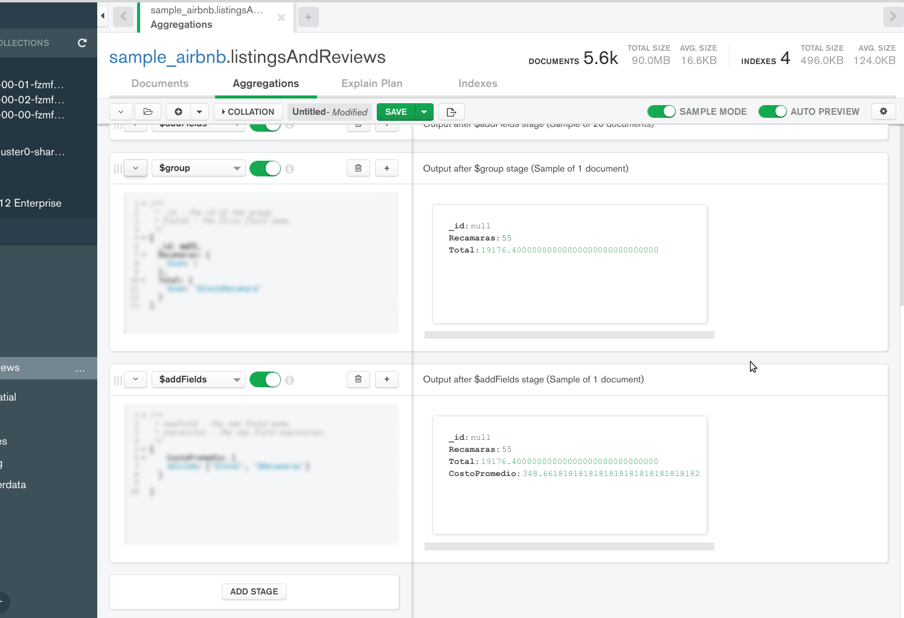

[`Fundamentos de Base de Datos`](../../Readme.md) > [`Sesión 08`](../Readme.md) > Reto-01
## Realizando consultas a base de datos no relacionales en la nube

### OBJETIVO
- Que el alumno aprenda como realizar consultas básicas en MongoDB Atlas
- Que el alumno fortalezca su habilidad para realizar consultas

### REQUISITOS
1. Repositorio actualizado
1. Usar la carpeta de trabajo `Sesion-08/Reto-01`
1. Contar con Compass instalado y conectado a la base de datos de muestra __sample_airbnb__.

### DESARROLLO
1. Obtener todas las publicaciones que tengan 50 o más comentarios, que la valoración sea mayor o igual a 80, que cuenten con conexión a Internet vía cable y estén ubicada en Brazil.

    En __Compass__ haciendo uso de la barra de filtrado se escribe el filtro:
    ```json
    { ??? }
    ```
    __Nota:__ Revisar la estructura de los documentos para poder armar la consulta.

    


1. Obtener el costo promedio de una recamara en Brazil en propiedades de tipo casa.

   Para esta consulta se hará uso del agregaciones con las siguientes etapas:

   __$match__:
   ```json
   {
     ???
   }
   ```

   __$addFields__:
   ```json
   {
     ???
   }
   ```

   __$group__:
   ```json
   {
       ???
   }
   ```

   __$addFields__:
   ```json
   {
       ???
   }
   ```

   Dando el resultado siguiente:
   

   El costo promedio por recamara es de 149.66
