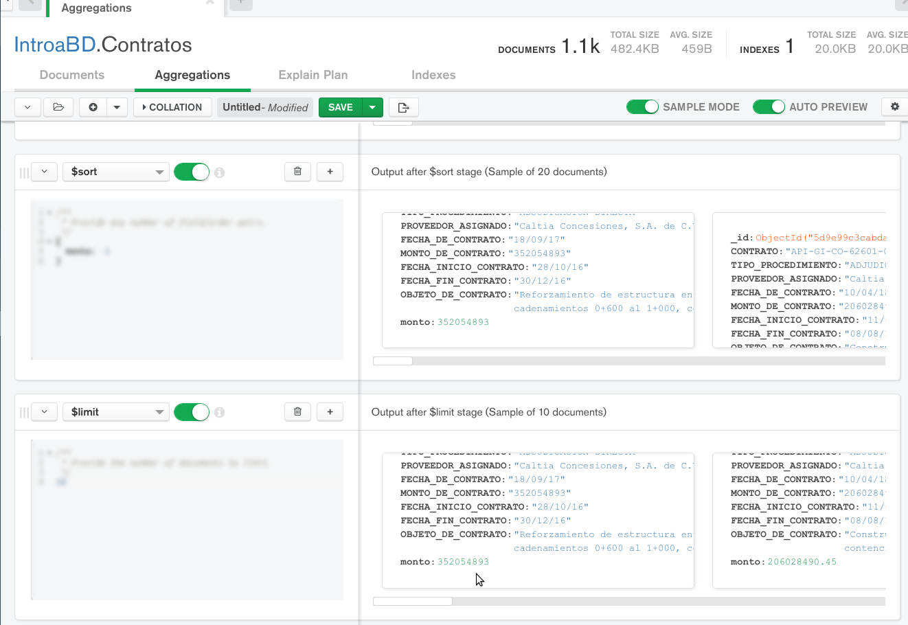
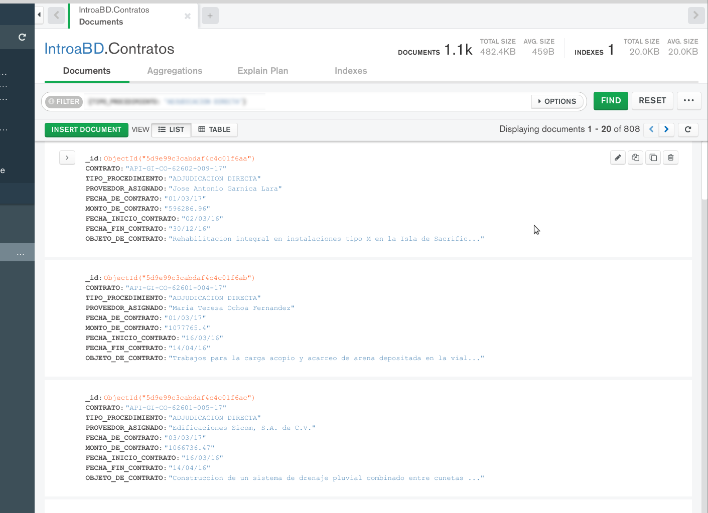

[`Fundamentos de Base de Datos`](../../Readme.md) > [`Sesión 08`](../Readme.md) > Reto-02
## Filtrado avanzado a bases de datos no relacionales en la nube

### OBJETIVO
- Que el alumno realice filtrado en MongoDB Atlas
- Que el alumno fortalezca su habilidad para comprender la estructura de los datos.

### REQUISITOS
1. Repositorio actualizado
1. Usar la carpeta de trabajo `Sesion-08/Reto-02`
1. Contar con Compass instalado y conectado a la base de datos propia __IntroaBD__.

### DESARROLLO
Nuevamente es importante comprender la estructura de los datos para poder realizar un análisis, en este caso se hará uso del conjunto de datos de los contratos de Obra Pública realizada por el estado de Veracruz, México.

1. De la colección __Contratos__ obtener los 10 contratos de mayor costo

   Desaofrtunadamente el campo de MONTO_DEL_CONTRATO es de tipo cadena, por lo que realizar comparaciones numéricas no será posible usando la barra de consultas, por lo que se hará uso de agregaciones.

   Lo primero es convertir el monto a decimal:
   __$addField__:
   ```json
   {
       monto: {$toDecimal: "$MONTO_DE_CONTRATO"}
   }
   ```

   Se orden con __$sort__:
   ```json
   {
     monto: -1
   }   
   ```

   Y se limita a 10 resultados con __$limit__:
   ```json
   10
   ```

   El resultado es el siguiente:
   

1. De la colección __Contratos__ obtener lista de compras cuyo tipo de procedimiento es por adjudicación directa.

    Se hace uso de la barra de consultas con __filter__:
    ```json
    {TIPO_PROCEDIMIENTO: "ADJUDICACION DIRECTA"}
    ```
    Es muy importante escribir los nombres de los atributos usando mayúsculas y minúsculas según sea el caso.
    
